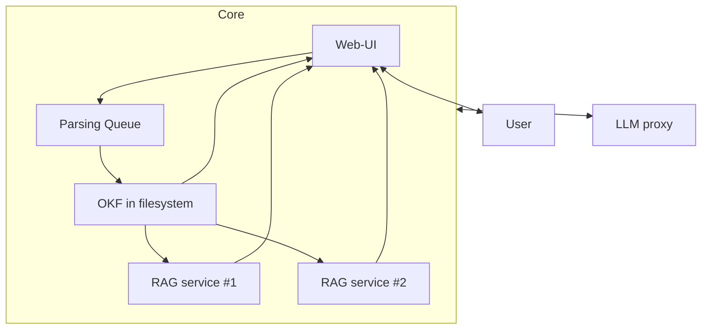
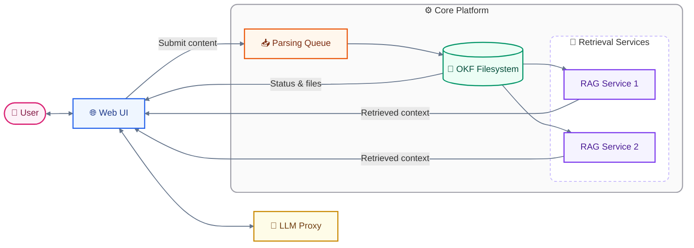
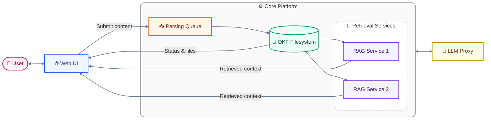
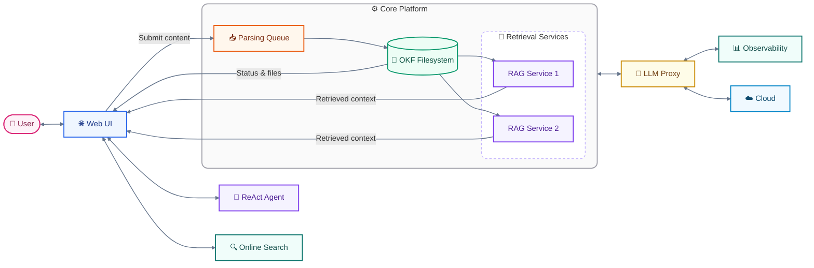
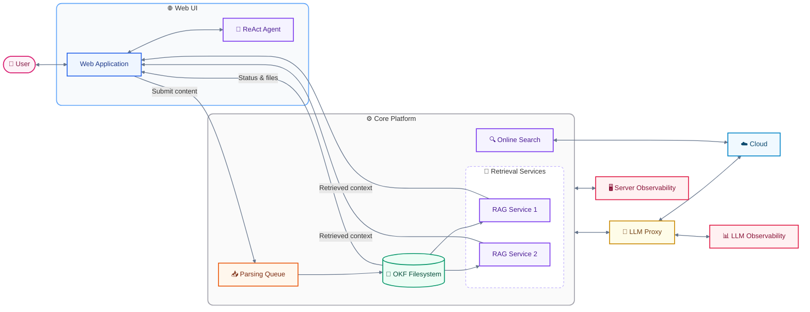
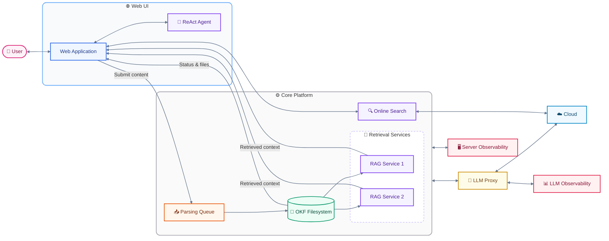
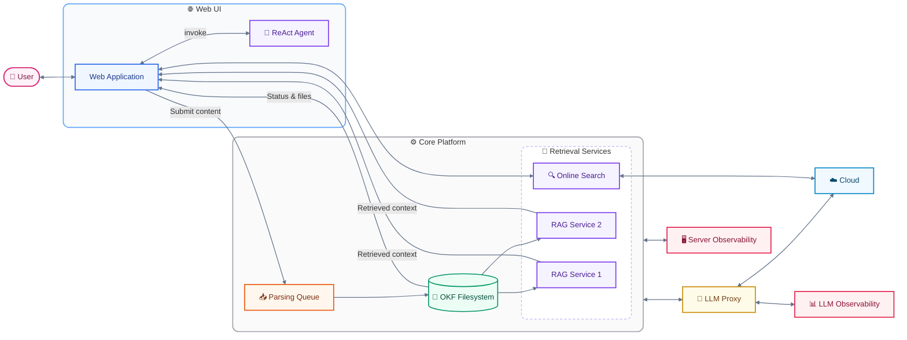

```mermaid

flowchart TD;
	
	Web <--> User["User"]

	subgraph Main["Core"]
		Web["Web-UI"] --> Parsing["Parsing Queue"]
		Parsing --> OKF["OKF in filesystem"]
		OKF --> RAG1["RAG service #1"]
		OKF --> RAG2["RAG service #2"]
		OKF --> Web
		RAG1 --> Web
		RAG2 --> Web
	end
	
	Main <--> Proxy["LLM proxy"]
	
```

```mermaid
flowchart LR
    %% ── External actors ──────────────────────────────
    User(["👤 User"])
    Web["🌐 Web UI"]
    Proxy["🧠 LLM Proxy"]

    User <--> Web
    Web <--> Proxy

    %% ── Core platform ────────────────────────────────
    subgraph Core["⚙️ Core Platform"]
        direction TB

        Parsing["📥 Parsing Queue"]
        OKF[("📁 OKF Filesystem")]

        subgraph RAG["🔎 Retrieval Services"]
            direction LR
            RAG1["RAG Service 1"]
            RAG2["RAG Service 2"]
        end

        Parsing --> OKF
        OKF --> RAG1
        OKF --> RAG2
    end

    %% ── Request and response flows ───────────────────
    Web -->|"Submit content"| Parsing
    OKF -->|"Status & files"| Web
    RAG1 -->|"Retrieved context"| Web
    RAG2 -->|"Retrieved context"| Web

    %% ── Styling ──────────────────────────────────────
    classDef user fill:#FDF2F8,stroke:#DB2777,color:#831843,stroke-width:2px;
    classDef interface fill:#EFF6FF,stroke:#2563EB,color:#1E3A8A,stroke-width:2px;
    classDef processing fill:#FFF7ED,stroke:#EA580C,color:#7C2D12,stroke-width:2px;
    classDef storage fill:#ECFDF5,stroke:#059669,color:#064E3B,stroke-width:2px;
    classDef service fill:#F5F3FF,stroke:#7C3AED,color:#4C1D95,stroke-width:2px;
    classDef proxy fill:#FEFCE8,stroke:#CA8A04,color:#713F12,stroke-width:2px;

    class User user;
    class Web interface;
    class Parsing processing;
    class OKF storage;
    class RAG1,RAG2 service;
    class Proxy proxy;

    style Core fill:#FAFAFA,stroke:#A1A1AA,stroke-width:2px,rx:12,ry:12
    style RAG fill:#FFFFFF,stroke:#C4B5FD,stroke-width:1.5px,stroke-dasharray: 5 4,rx:10,ry:10

    linkStyle default stroke:#64748B,stroke-width:1.5px;
```

```mermaid
flowchart LR
    %% ── External actors ──────────────────────────────
    User(["👤 User"])
    Web["🌐 Web UI"]
    Proxy["🧠 LLM Proxy"]

    User <--> Web

    %% ── Core platform ────────────────────────────────
    subgraph Core["⚙️ Core Platform"]
        direction TB

        Parsing["📥 Parsing Queue"]
        OKF[("📁 OKF Filesystem")]

        subgraph RAG["🔎 Retrieval Services"]
            direction LR
            RAG1["RAG Service 1"]
            RAG2["RAG Service 2"]
        end

        Parsing --> OKF
        OKF --> RAG1
        OKF --> RAG2
    end

    %% ── Request and response flows ───────────────────
    Web -->|"Submit content"| Parsing
    OKF -->|"Status & files"| Web
    RAG1 -->|"Retrieved context"| Web
    RAG2 -->|"Retrieved context"| Web

    %% ── LLM integration ──────────────────────────────
    Core <--> Proxy

    %% ── Styling ──────────────────────────────────────
    classDef user fill:#FDF2F8,stroke:#DB2777,color:#831843,stroke-width:2px;
    classDef interface fill:#EFF6FF,stroke:#2563EB,color:#1E3A8A,stroke-width:2px;
    classDef processing fill:#FFF7ED,stroke:#EA580C,color:#7C2D12,stroke-width:2px;
    classDef storage fill:#ECFDF5,stroke:#059669,color:#064E3B,stroke-width:2px;
    classDef service fill:#F5F3FF,stroke:#7C3AED,color:#4C1D95,stroke-width:2px;
    classDef proxy fill:#FEFCE8,stroke:#CA8A04,color:#713F12,stroke-width:2px;

    class User user;
    class Web interface;
    class Parsing processing;
    class OKF storage;
    class RAG1,RAG2 service;
    class Proxy proxy;

    style Core fill:#FAFAFA,stroke:#A1A1AA,stroke-width:2px,rx:12,ry:12
    style RAG fill:#FFFFFF,stroke:#C4B5FD,stroke-width:1.5px,stroke-dasharray: 5 4,rx:10,ry:10

    linkStyle default stroke:#64748B,stroke-width:1.5px;
```

```mermaid
flowchart LR
    %% ── External actors & integrations ────────────────
    User(["👤 User"])
    Web["🌐 Web UI"]
    ReAct["🤖 ReAct Agent"]
    Search["🔍 Online Search"]
    Proxy["🧠 LLM Proxy"]
    Observe["📊 Observability"]
    Cloud["☁️ Cloud"]

    User <--> Web
    Web <--> ReAct
    Web <--> Search

    Proxy <--> Observe
    Proxy <--> Cloud

    %% ── Core platform ────────────────────────────────
    subgraph Core["⚙️ Core Platform"]
        direction TB

        Parsing["📥 Parsing Queue"]
        OKF[("📁 OKF Filesystem")]

        subgraph RAG["🔎 Retrieval Services"]
            direction LR
            RAG1["RAG Service 1"]
            RAG2["RAG Service 2"]
        end

        Parsing --> OKF
        OKF --> RAG1
        OKF --> RAG2
    end

    %% ── Core flows ───────────────────────────────────
    Web -->|"Submit content"| Parsing
    OKF -->|"Status & files"| Web
    RAG1 -->|"Retrieved context"| Web
    RAG2 -->|"Retrieved context"| Web

    Core <--> Proxy

    %% ── Styling ──────────────────────────────────────
    classDef user fill:#FDF2F8,stroke:#DB2777,color:#831843,stroke-width:2px;
    classDef interface fill:#EFF6FF,stroke:#2563EB,color:#1E3A8A,stroke-width:2px;
    classDef processing fill:#FFF7ED,stroke:#EA580C,color:#7C2D12,stroke-width:2px;
    classDef storage fill:#ECFDF5,stroke:#059669,color:#064E3B,stroke-width:2px;
    classDef service fill:#F5F3FF,stroke:#7C3AED,color:#4C1D95,stroke-width:2px;
    classDef proxy fill:#FEFCE8,stroke:#CA8A04,color:#713F12,stroke-width:2px;
    classDef integration fill:#F0FDFA,stroke:#0F766E,color:#134E4A,stroke-width:2px;
    classDef cloud fill:#F0F9FF,stroke:#0284C7,color:#0C4A6E,stroke-width:2px;

    class User user;
    class Web interface;
    class Parsing processing;
    class OKF storage;
    class RAG1,RAG2,ReAct service;
    class Proxy proxy;
    class Search,Observe integration;
    class Cloud cloud;

    style Core fill:#FAFAFA,stroke:#A1A1AA,stroke-width:2px,rx:12,ry:12
    style RAG fill:#FFFFFF,stroke:#C4B5FD,stroke-width:1.5px,stroke-dasharray: 5 4,rx:10,ry:10

    linkStyle default stroke:#64748B,stroke-width:1.5px;
```

```mermaid
flowchart LR
    %% ── External actor ────────────────────────────────
    User(["👤 User"])

    %% ── Web UI ───────────────────────────────────────
    subgraph WebUI["🌐 Web UI"]
        direction TB
        WebApp["Web Application"]
        ReAct["🤖 ReAct Agent"]

        WebApp <--> ReAct
    end

    User <--> WebApp

    %% ── Core platform ────────────────────────────────
    subgraph Core["⚙️ Core Platform"]
        direction TB

        Parsing["📥 Parsing Queue"]
        OKF[("📁 OKF Filesystem")]
        Search["🔍 Online Search"]

        subgraph RAG["🔎 Retrieval Services"]
            direction LR
            RAG1["RAG Service 1"]
            RAG2["RAG Service 2"]
        end

        Parsing --> OKF
        OKF --> RAG1
        OKF --> RAG2
    end

    %% ── Platform connections ─────────────────────────
    WebApp -->|"Submit content"| Parsing
    OKF -->|"Status & files"| WebApp
    RAG1 -->|"Retrieved context"| WebApp
    RAG2 -->|"Retrieved context"| WebApp

    %% ── LLM, cloud & observability ───────────────────
    Proxy["🧠 LLM Proxy"]
    Cloud["☁️ Cloud"]
    LLMObserve["📊 LLM Observability"]
    ServerObserve["🖥️ Server Observability"]

    Core <--> Proxy
    Proxy <--> Cloud
    Proxy <--> LLMObserve
    Core <--> ServerObserve
    Search <--> Cloud

    %% ── Styling ──────────────────────────────────────
    classDef user fill:#FDF2F8,stroke:#DB2777,color:#831843,stroke-width:2px;
    classDef interface fill:#EFF6FF,stroke:#2563EB,color:#1E3A8A,stroke-width:2px;
    classDef processing fill:#FFF7ED,stroke:#EA580C,color:#7C2D12,stroke-width:2px;
    classDef storage fill:#ECFDF5,stroke:#059669,color:#064E3B,stroke-width:2px;
    classDef service fill:#F5F3FF,stroke:#7C3AED,color:#4C1D95,stroke-width:2px;
    classDef proxy fill:#FEFCE8,stroke:#CA8A04,color:#713F12,stroke-width:2px;
    classDef observability fill:#FFF1F2,stroke:#E11D48,color:#881337,stroke-width:2px;
    classDef cloud fill:#F0F9FF,stroke:#0284C7,color:#0C4A6E,stroke-width:2px;

    class User user;
    class WebApp interface;
    class Parsing processing;
    class OKF storage;
    class ReAct,RAG1,RAG2,Search service;
    class Proxy proxy;
    class LLMObserve,ServerObserve observability;
    class Cloud cloud;

    style WebUI fill:#F8FAFC,stroke:#60A5FA,stroke-width:2px,rx:12,ry:12
    style Core fill:#FAFAFA,stroke:#A1A1AA,stroke-width:2px,rx:12,ry:12
    style RAG fill:#FFFFFF,stroke:#C4B5FD,stroke-width:1.5px,stroke-dasharray: 5 4,rx:10,ry:10

    linkStyle default stroke:#64748B,stroke-width:1.5px;
```

```mermaid
flowchart LR
    %% ── External actor ────────────────────────────────
    User(["👤 User"])

    %% ── Web UI ───────────────────────────────────────
    subgraph WebUI["🌐 Web UI"]
        direction TB
        WebApp["Web Application"]
        ReAct["🤖 ReAct Agent"]

        WebApp <--> ReAct
    end

    User <--> WebApp

    %% ── Core platform ────────────────────────────────
    subgraph Core["⚙️ Core Platform"]
        direction TB

        Parsing["📥 Parsing Queue"]
        OKF[("📁 OKF Filesystem")]
        Search["🔍 Online Search"]

        subgraph RAG["🔎 Retrieval Services"]
            direction LR
            RAG1["RAG Service 1"]
            RAG2["RAG Service 2"]
        end

        Parsing --> OKF
        OKF --> RAG1
        OKF --> RAG2
    end

    %% ── Platform connections ─────────────────────────
    WebApp -->|"Submit content"| Parsing
    OKF -->|"Status & files"| WebApp
    RAG1 -->|"Retrieved context"| WebApp
    RAG2 -->|"Retrieved context"| WebApp
    WebApp <--> Search

    %% ── LLM, cloud & observability ───────────────────
    Proxy["🧠 LLM Proxy"]
    Cloud["☁️ Cloud"]
    LLMObserve["📊 LLM Observability"]
    ServerObserve["🖥️ Server Observability"]

    Core <--> Proxy
    Proxy <--> Cloud
    Proxy <--> LLMObserve
    Core <--> ServerObserve
    Search <--> Cloud

    %% ── Styling ──────────────────────────────────────
    classDef user fill:#FDF2F8,stroke:#DB2777,color:#831843,stroke-width:2px;
    classDef interface fill:#EFF6FF,stroke:#2563EB,color:#1E3A8A,stroke-width:2px;
    classDef processing fill:#FFF7ED,stroke:#EA580C,color:#7C2D12,stroke-width:2px;
    classDef storage fill:#ECFDF5,stroke:#059669,color:#064E3B,stroke-width:2px;
    classDef service fill:#F5F3FF,stroke:#7C3AED,color:#4C1D95,stroke-width:2px;
    classDef proxy fill:#FEFCE8,stroke:#CA8A04,color:#713F12,stroke-width:2px;
    classDef observability fill:#FFF1F2,stroke:#E11D48,color:#881337,stroke-width:2px;
    classDef cloud fill:#F0F9FF,stroke:#0284C7,color:#0C4A6E,stroke-width:2px;

    class User user;
    class WebApp interface;
    class Parsing processing;
    class OKF storage;
    class ReAct,RAG1,RAG2,Search service;
    class Proxy proxy;
    class LLMObserve,ServerObserve observability;
    class Cloud cloud;

    style WebUI fill:#F8FAFC,stroke:#60A5FA,stroke-width:2px,rx:12,ry:12
    style Core fill:#FAFAFA,stroke:#A1A1AA,stroke-width:2px,rx:12,ry:12
    style RAG fill:#FFFFFF,stroke:#C4B5FD,stroke-width:1.5px,stroke-dasharray: 5 4,rx:10,ry:10

    linkStyle default stroke:#64748B,stroke-width:1.5px;
```

```mermaid
flowchart LR
    %% ── External actor ────────────────────────────────
    User(["👤 User"])

    %% ── Web UI ───────────────────────────────────────
    subgraph WebUI["🌐 Web UI"]
        direction TB
        WebApp["Web Application"]
        ReAct["🤖 ReAct Agent"]

        WebApp -->|"Invoke agent"| ReAct
    end

    User <--> WebApp

    %% ── Core platform ────────────────────────────────
    subgraph Core["⚙️ Core Platform"]
        direction TB

        Parsing["📥 Parsing Queue"]
        OKF[("📁 OKF Filesystem")]
        Search["🔍 Online Search"]

        subgraph RAG["🔎 Retrieval Services"]
            direction LR
            RAG1["RAG Service 1"]
            RAG2["RAG Service 2"]
        end

        Parsing --> OKF
        OKF --> RAG1
        OKF --> RAG2
    end

    %% ── Platform connections ─────────────────────────
    WebApp -->|"Submit content"| Parsing
    OKF -->|"Status & files"| WebApp
    RAG1 -->|"Retrieved context"| WebApp
    RAG2 -->|"Retrieved context"| WebApp
    WebApp <--> Search

    %% ── LLM, cloud & observability ───────────────────
    Proxy["🧠 LLM Proxy"]
    Cloud["☁️ Cloud"]
    LLMObserve["📊 LLM Observability"]
    ServerObserve["🖥️ Server Observability"]

    Core <--> Proxy
    Proxy <--> Cloud
    Proxy <--> LLMObserve
    Core <--> ServerObserve
    Search <--> Cloud

    %% ── Styling ──────────────────────────────────────
    classDef user fill:#FDF2F8,stroke:#DB2777,color:#831843,stroke-width:2px;
    classDef interface fill:#EFF6FF,stroke:#2563EB,color:#1E3A8A,stroke-width:2px;
    classDef processing fill:#FFF7ED,stroke:#EA580C,color:#7C2D12,stroke-width:2px;
    classDef storage fill:#ECFDF5,stroke:#059669,color:#064E3B,stroke-width:2px;
    classDef service fill:#F5F3FF,stroke:#7C3AED,color:#4C1D95,stroke-width:2px;
    classDef proxy fill:#FEFCE8,stroke:#CA8A04,color:#713F12,stroke-width:2px;
    classDef observability fill:#FFF1F2,stroke:#E11D48,color:#881337,stroke-width:2px;
    classDef cloud fill:#F0F9FF,stroke:#0284C7,color:#0C4A6E,stroke-width:2px;

    class User user;
    class WebApp interface;
    class Parsing processing;
    class OKF storage;
    class ReAct,RAG1,RAG2,Search service;
    class Proxy proxy;
    class LLMObserve,ServerObserve observability;
    class Cloud cloud;

    style WebUI fill:#F8FAFC,stroke:#60A5FA,stroke-width:2px,rx:12,ry:12
    style Core fill:#FAFAFA,stroke:#A1A1AA,stroke-width:2px,rx:12,ry:12
    style RAG fill:#FFFFFF,stroke:#C4B5FD,stroke-width:1.5px,stroke-dasharray: 5 4,rx:10,ry:10

    linkStyle default stroke:#64748B,stroke-width:1.5px;
```

```mermaid
flowchart LR
    %% ── External actor ────────────────────────────────
    User(["👤 User"])

    %% ── Web UI ───────────────────────────────────────
    subgraph WebUI["🌐 Web UI"]
        direction LR
        WebApp["Web Application"]
        ReAct["🤖 ReAct Agent"]
        
        WebApp <==>|"invoke"| ReAct
    end

    User <--> WebApp

    %% ── Core platform ────────────────────────────────
    subgraph Core["⚙️ Core Platform"]
        direction TB

        Parsing["📥 Parsing Queue"]
        OKF[("📁 OKF Filesystem")]

        subgraph RAG["🔎 Retrieval Services"]
            direction LR
            RAG1["RAG Service 1"]
            RAG2["RAG Service 2"]
            Search["🔍 Online Search"]
        end

        Parsing --> OKF
        OKF --> RAG1
        OKF --> RAG2
    end

    %% ── Platform connections ─────────────────────────
    WebApp -->|"Submit content"| Parsing
    OKF -->|"Status & files"| WebApp
    RAG1 -->|"Retrieved context"| WebApp
    RAG2 -->|"Retrieved context"| WebApp
    WebApp <--> Search

    %% ── LLM, cloud & observability ───────────────────
    Proxy["🧠 LLM Proxy"]
    Cloud["☁️ Cloud"]
    LLMObserve["📊 LLM Observability"]
    ServerObserve["🖥️ Server Observability"]

    Core <--> Proxy
    Proxy <--> Cloud
    Proxy <--> LLMObserve
    Core <--> ServerObserve
    Search <--> Cloud

    %% ── Styling ──────────────────────────────────────
    classDef user fill:#FDF2F8,stroke:#DB2777,color:#831843,stroke-width:2px;
    classDef interface fill:#EFF6FF,stroke:#2563EB,color:#1E3A8A,stroke-width:2px;
    classDef processing fill:#FFF7ED,stroke:#EA580C,color:#7C2D12,stroke-width:2px;
    classDef storage fill:#ECFDF5,stroke:#059669,color:#064E3B,stroke-width:2px;
    classDef service fill:#F5F3FF,stroke:#7C3AED,color:#4C1D95,stroke-width:2px;
    classDef proxy fill:#FEFCE8,stroke:#CA8A04,color:#713F12,stroke-width:2px;
    classDef observability fill:#FFF1F2,stroke:#E11D48,color:#881337,stroke-width:2px;
    classDef cloud fill:#F0F9FF,stroke:#0284C7,color:#0C4A6E,stroke-width:2px;

    class User user;
    class WebApp interface;
    class Parsing processing;
    class OKF storage;
    class ReAct,RAG1,RAG2,Search service;
    class Proxy proxy;
    class LLMObserve,ServerObserve observability;
    class Cloud cloud;

    style WebUI fill:#F8FAFC,stroke:#60A5FA,stroke-width:2px,rx:12,ry:12
    style Core fill:#FAFAFA,stroke:#A1A1AA,stroke-width:2px,rx:12,ry:12
    style RAG fill:#FFFFFF,stroke:#C4B5FD,stroke-width:1.5px,stroke-dasharray: 5 4,rx:10,ry:10

    linkStyle default stroke:#64748B,stroke-width:1.5px;
```

