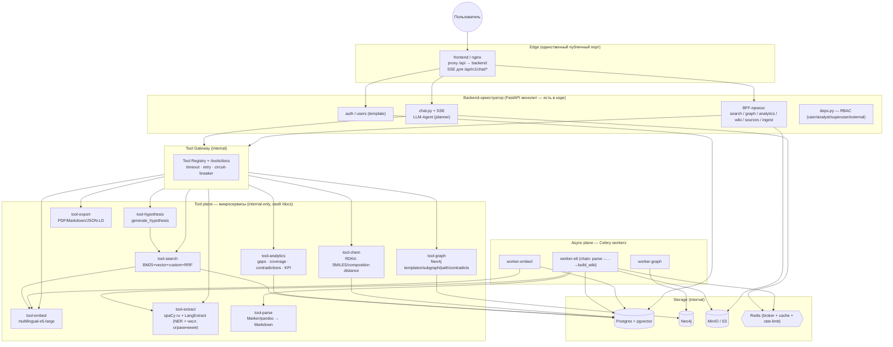

# Научный клубок — Техническая спецификация V4

> **Проект:** Карта знаний R&D для горно-металлургической отрасли (Knowledge Graph + поисково-аналитическая система)
> **Команда:** 5 человек
> **Формат:** хакатон, time-boxed delivery
> **Версия:** 4.0 — «тулы как микросервисы» + приведение домена к реальной задаче
> **Основано на:** текущий код репозитория (contract-first каркас на `full-stack-fastapi-template`), идеи [SPEC_V3.md](SPEC_V3.md) (провенанс, гибридный поиск, custom distance, gap analysis, hypothesis factory, claims validator) и [SPEC_V0.md](SPEC_V0.md) (микросервисная декомпозиция, read/write split)

---

## §0. Что меняется относительно V3 (дельта)

Эта спека — не переписывание с нуля. Мы берём **уже существующий каркас** (все доменные роуты, SQLModel-модели, миграции, 3 Celery-воркера, полный `compose`-стек — есть в коде; внутренности застабаны и помечены `TODO(SPEC_V3 …)`) и делаем два принципиальных сдвига.

| # | Было в V3 | Стало в V4 | Почему |
|---|-----------|------------|--------|
| 1 | **Модульный монолит**: agent tools — in-process Python-функции `app.services.*` (решение V3 §3.128). Микросервисы — явно out of scope. | **Tool plane**: каждый тул агента — **отдельный микросервис** (свой контейнер, свой `/docs`, своя изоляция зависимостей). Backend = оркестратор/BFF. | Прямой запрос команды. Плюс: изоляция ML-зависимостей (RDKit/torch/spaCy/marker конфликтуют — это был **главный риск V3**), независимое масштабирование, self-describing тулы для жюри, MCP-совместимость. |
| 2 | Домен = сплавы/суперсплавы/палладий (узко). Онтология: Material, Experiment, Regime, Property, Equipment, Lab, Researcher, Result. | Домен = **горно-металлургия целиком** (гидро-/пиро-металлургия, экология, переработка отходов). Онтология расширена: **Process, Publication, Expert, Facility, Conclusion**, геопризнак (РФ vs мир), модель верификации, числовые диапазоны, отношение **contradicts**. | `docs/TASK_EXPLANATION.md` — источник правды по домену. V3 не покрывал процессы, публикации, экспертов, географию, противоречия. |

Всё остальное из V3 (провенанс, RRF, кастомная метрика расстояния, gap heatmap, degraded mode, hold-out live reindex, JWT/RBAC, Alembic-дисциплина, merge windows) — **остаётся в силе** и переносится сюда.

---

## §1. Постановка проблемы

### Боль (из `TASK_EXPLANATION.md`)

В точке 0 проблема не в отсутствии моделей, а в отсутствии **общей структуры знаний**: что уже пробовали, какие данные есть, какие выводы подтверждены, где противоречия, кто носитель экспертизы. Для горно-металлургических R&D это даёт:

- **Потеря институциональной памяти** — знания об обессоливании воды, циркуляции католита, распределении драгметаллов между штейном и шлаком рассеяны по отчётам, презентациям, личным архивам.
- **Дублирование усилий** — команды повторяют литобзоры, потому что не видят уже сделанного.
- **Сложность междисциплинарного поиска** — не связать «режим кучного выщелачивания в холодном климате» с «выходом металла».
- **Низкая скорость решений** — ответ на «какие решения подачи электролита в ванны электроэкстракции никеля есть в мире?» требует ручного сбора из десятков источников.
- **Противоречивые выводы** — нет единой верифицированной базы → конфликты интерпретаций (напр. по оптимальной скорости циркуляции католита).

### Контрольные запросы (система обязана отвечать)

1. «Какие методы обессоливания воды подходят для обогатительной фабрики, если вода содержит сульфаты/хлориды/Ca/Mg/Na по 200–300 мг/л, а требуемый сухой остаток ≤1000 мг/дм³?» — **материал + процесс + числовые диапазоны**.
2. «Какие технические решения циркуляции католита при электроэкстракции никеля описаны в мире и какая скорость потока оптимальна?» — **процесс + сравнение практик + числовой параметр**.
3. «Покажите все эксперименты и публикации по распределению Au/Ag/МПГ между медным/никелевым штейном и шлаком за последние 5 лет» — **материалы + временной диапазон + типы источников**.
4. «Какие способы закачки шахтных вод в глубокие горизонты применялись в России и за рубежом, и каковы их ТЭП?» — **процесс + география (РФ vs мир) + экономические показатели**.

### Пользователи / роли

| Роль | Потребность |
|------|-------------|
| **R&D-инженер (researcher)** | Быстро найти релевантные эксперименты/решения по материалу, процессу, условиям |
| **Аналитик (analyst)** | Строить связи, генерировать литобзоры с provenance, сравнивать РФ vs мир, видеть противоречия |
| **Руководитель проекта / лаборатории** | Дашборды покрытия знаний, зоны риска, активность команд |
| **Администратор (admin/superuser)** | Загрузка/переиндексация корпуса, управление доступом |
| **Внешний партнёр (external)** | Ограниченный доступ (без чувствительных внутренних отчётов) |

---

## §2. Цели и метрики успеха (KPI)

### Цели

1. Работающий развёрнутый онлайн-прототип: принимает корпус документов, отвечает на запросы в свободной форме (RU/EN).
2. Единая карта знаний: связать Material, Process, Experiment, Property, Regime, Equipment, Facility, Expert, Publication, Conclusion в одном пространстве.
3. **Провенанс по умолчанию**: каждое утверждение — со ссылкой на источник, уровнем достоверности и датой актуализации.
4. **Многопараметрические запросы**: материал + процесс + условия + география + временной диапазон + числовые ограничения.
5. Выявлять **пробелы** (непроведённые эксперименты) и **противоречия** (конфликтующие выводы).

### KPI

| Метрика | Целевое значение | Способ измерения |
|---------|-------------------|-------------------|
| **Время сложного запроса** (3–4 уровня связей + числовые фильтры) | ≤ 3–5 c (цель задачи), ≤ 15 c для полного LLM-ответа | Замер end-to-end, `GET /api/v1/metrics` |
| **Точность извлечения сущностей/числовых ограничений** | > 80% F1 на hold-out | Ручная разметка 50–100 фрагментов, `eval/run_eval.py` |
| **Provenance coverage** | 100% утверждений со ссылкой | Автопроверка наличия proof-ref в каждом claim |
| **Полнота графа** | > 70% сущностей связаны | Отношение связанных нод к изолированным |
| **Live-добавление** | Переиндексация hold-out < 3 мин | Живое демо |
| **Кастомная RAG-метрика** | Выше baseline cosine | A/B на тестовых запросах |
| **Детекция противоречий** | ≥ N подтверждённых конфликтов на демо-корпусе | Список `contradicts` рёбер в UI |
| **Health тул-плоскости** | Все тулы `/health` = 200; агрегируется в `/metrics` | Tool Gateway health-check |

Инструментирование: роут `GET /api/v1/metrics` в backend агрегирует KPI из Postgres + health тул-сервисов; директория `eval/` с `run_eval.py`.

---

## §3. Архитектура системы (★ ключевой раздел)

### Идея

Три плоскости вокруг общего хранилища:

- **Edge/Orchestrator** — единый публичный вход (nginx фронтенд-контейнера) + **backend-оркестратор** (существующий FastAPI): auth, chat-сессии + SSE, RBAC, provenance/sources, приём ingest, и **LLM-агент**, который *планирует и вызывает тулы по HTTP*.
- **Tool plane** — **каждый тул агента = отдельный микросервис** (internal-only, свой `/docs`, `/health`, `/manifest`, своя изоляция зависимостей). Доменные роуты backend (`/search`, `/graph`, `/analytics`, `/wiki`) становятся тонким **BFF-прокси** к соответствующим тул-сервисам (контракт для фронтенда не меняется).
- **Async plane** — Celery-воркеры ETL (9 стадий), которые вызывают **те же** тяжёлые тул-сервисы (parse/extract/embed), а не тащат ML-стек в себя.

### Высокоуровневая схема



### Ключевые архитектурные решения

| # | Решение |
|---|---------|
| 1 | **Tool-as-microservice.** Каждый тул агента — независимый контейнер с FastAPI, `/docs`, `/health`, `/manifest`. Агент вызывает тул по HTTP, а не в процессе. |
| 2 | **Единый контракт тула** (`POST /invoke` + envelope) и **Tool Registry** — агент не хардкодит адреса, а берёт манифесты из реестра. Новый тул = поднять контейнер + зарегистрировать. |
| 3 | **Изоляция зависимостей — главная причина.** RDKit, torch/sentence-transformers, spaCy+ru-модель, marker-pdf, langextract больше не резолвятся в одном lockfile. Каждый тул — свой uv-проект/`Dockerfile`. |
| 4 | **Backend-оркестратор остаётся монолитом** для user-facing (auth, chat, SSE, RBAC, provenance). Микросервисы — только tool plane + async plane. Это гибрид V3 (надёжный монолит на входе) и V0 (микросервисы внутри). |
| 5 | **BFF-прокси**: `/search`, `/graph`, `/analytics`, `/wiki` в backend проксируют в тул-сервисы. OpenAPI-контракт для фронтенда неизменен → фронт и генерируемый клиент не переписываются. |
| 6 | **Tool Gateway** (тонкий internal-слой): единый список тулов, агрегированные `/docs`, timeout/retry/circuit-breaker, health-агрегация в `/metrics`. Для хакатона может быть библиотекой в backend + config, а не отдельным контейнером. |
| 7 | **Degraded mode на каждый тул.** Тул недоступен → circuit-breaker → агент отдаёт деградированный ответ (таблица + provenance без summary; поиск без custom-канала; граф → 503/SQL-fallback). Один упавший тул не роняет демо. |
| 8 | **MCP-совместимость (бонус).** Единый контракт тула тривиально оборачивается в MCP-сервер → тулы подключаемы к любому агенту (Cursor/Claude). Слайд «tools are portable». |
| 9 | **Async и online делят тул-сервисы.** ETL-воркеры и онлайн-агент зовут одни и те же `tool-parse/extract/embed` → модель эмбеддингов грузится один раз, нет дублей зависимостей. |
| 10 | **Провенанс по умолчанию** (из V3): каждый факт хранит `document_id + page + paragraph` + `confidence` + `verified_at`. |
| 11 | **Read/write split (из V0, лёгкая версия):** тул-плоскость — read-only к Postgres; запись только через async-плоскость (Celery). Онлайн-агент физически не может испортить данные. |
| 12 | **PostgreSQL 18** (`pgvector/pgvector:pg18`), **Python 3.11** — как в текущем коде. |

### Единый контракт тул-сервиса

Каждый тул-микросервис обязан реализовать:

```
GET  /health                 → {"status":"ok","tool":"<name>","version":"..."}
GET  /manifest               → описание тула для агента (JSON Schema in/out, стоимость, degraded-поведение)
POST /invoke                 → выполнить тул (стандартный envelope)
GET  /docs                   → Swagger UI (self-describing)
```

**Envelope запроса/ответа `/invoke`:**

```jsonc
// request
{ "tool": "hybrid_search", "params": { /* по manifest.input_schema */ },
  "context": { "request_id": "uuid", "user_role": "researcher", "locale": "ru" } }

// response
{ "ok": true, "tool": "hybrid_search", "result": { /* по manifest.output_schema */ },
  "provenance": [ { "document_id": "uuid", "page": 12, "paragraph": "..." } ],
  "meta": { "latency_ms": 120, "degraded": false } }
```

**Манифест тула** (агент читает его, чтобы знать, когда и как вызвать):

```jsonc
{
  "name": "hybrid_search",
  "description": "Гибридный поиск экспериментов/решений по корпусу...",
  "priority": "P0",
  "input_schema":  { /* JSON Schema */ },
  "output_schema": { /* JSON Schema */ },
  "degraded_behavior": "vector-only без custom-канала",
  "reads": ["postgres"], "writes": [],
  "deps": ["pgvector"], "mcp": true
}
```

### Изоляция зависимостей (по факту конфликтов)

Правило то же, что в V3, но применяется к тулам, а не воркерам: сначала пробуем объединить лёгкие тулы под одним базовым образом; если `uv lock` падает — **каждый тяжёлый тул получает свой образ/`uv.lock`**. Ожидаемые «тяжёлые» одиночки: `tool-embed` (torch), `tool-chem` (rdkit), `tool-extract` (spaCy+ru), `tool-parse` (marker-pdf). Лёгкие (`tool-search`, `tool-graph`, `tool-analytics`, `tool-hypothesis`, `tool-export`) могут делить общий базовый образ + `packages/tool_sdk`.

### Структура репозитория (расширение текущей)

```
metalcrow/
├── backend/                         # ЕСТЬ. Оркестратор: auth, chat+SSE, BFF-прокси, RBAC, LLM-agent
│   └── app/services/agent/          # planner + tool client (HTTP через Tool Gateway)
│   └── app/services/tool_client.py  # НОВОЕ: HTTP-клиент к тулам (timeout/retry/circuit-breaker)
├── tools/                           # НОВОЕ: каждый тул — независимый uv-проект
│   ├── search/    (Dockerfile, pyproject.toml, uv.lock, app/)   # BM25+vector+custom+RRF
│   ├── graph/     ...       # Neo4j templates/subgraph/path/contradicts
│   ├── analytics/ ...       # gaps/coverage/contradictions/KPI
│   ├── hypothesis/...       # generate_hypothesis
│   ├── chem/      ...       # RDKit: SMILES/composition distance
│   ├── embed/     ...       # multilingual-e5-large (online + batch)
│   ├── extract/   ...       # spaCy ru + LangExtract
│   ├── parse/     ...       # Marker/pandoc
│   └── export/    ...       # PDF/Markdown/JSON-LD
├── packages/
│   ├── schema/       # НОВОЕ: общие SQLModel-таблицы experiments.* (path-dep для тулов и воркеров)
│   └── tool_sdk/     # НОВОЕ: базовый FastAPI-каркас тула (envelope, /health, /manifest, /invoke)
├── workers/          # ЕСТЬ. etl/embed/graph — теперь зовут tool-parse/extract/embed по HTTP
├── frontend/         # ЕСТЬ. + новые экраны: search, contradictions, compare, dashboards
├── dictionaries/     # НОВОЕ: synonyms_ru_en.yaml, regime_buckets.yaml, distance_weights.yaml, units.yaml
├── eval/             # НОВОЕ: queries.json, run_eval.py
├── seed/  holdout/   # НОВОЕ
└── compose.yml / .override / .prod  # ЕСТЬ. + сервисы tool-*
```

---

## §4. Доменная модель / Онтология (расширена под задачу)

### Сущности (онтология из `TASK_EXPLANATION.md`)

| Сущность | Описание | Статус относительно V3 |
|----------|----------|------------------------|
| **Material** | Материалы/вещества: сульфаты, хлориды, никелевые катоды, техногенный гипс, угольные отходы. `material_type`, `formula`, `composition` (JSONB), `smiles?` | было |
| **Process** | Технологический процесс: выщелачивание, электроэкстракция, обессоливание, взвешенная плавка, закачка шахтных вод. `process_type`, `domain` (гидро/пиро/экология/переработка) | **НОВОЕ** |
| **Regime / Condition** | Условия: температура, давление, длительность, среда, климат, скорость потока, концентрации. `steps[]` | было (расширено климатом/потоком) |
| **Property** | Измеряемое свойство/показатель: выход металла, сухой остаток, ТЭП (капзатраты, OPEX), экопоказатель | было (расширено экономикой/экологией) |
| **Experiment** | Опыт/протокол: связывает Material×Process×Regime×Property×Result | было |
| **Equipment / Facility** | Ванны электроэкстракции, печи взвешенной плавки, системы очистки газов; установки, фабрики | было (Facility — обобщение Lab) |
| **Publication** | Статья/патент/отчёт/диссертация. `pub_type`, `year`, `doi?`, `lang` (ru/en), `origin` (domestic/foreign) | **НОВОЕ** |
| **Expert / Researcher** | Носитель компетенции, автор, лаборатория. `expertise_areas[]` | было (Expert — обобщение) |
| **Conclusion / Recommendation** | Верифицированный вывод/рекомендация с `confidence`, `verified_at`, `proof_ref` | **НОВОЕ (явно)** |
| **Document / Source** | Файл в MinIO: страница, абзац — основа provenance | было |
| **Tag / Topic** | Тематическая метка из таксономии | было |

### Ключевые отношения

```
Experiment  -uses_material->        Material
Experiment  -operates_at_condition->Regime
Process     -uses_material->        Material
Process     -produces_output->      Material | Property
Experiment  -measures->             Property
Experiment  -has_result->           Result
Experiment  -performed_at->         Facility
Experiment  -by->                   Expert
Conclusion  -described_in->         Publication | Document
Conclusion  -validated_by->         Experiment | Publication
Conclusion  -contradicts->          Conclusion        ← детекция противоречий
Expert      -expert_in->            Topic | Process
Material    -related_to->           Material
* каждая нода/факт -sourced_from->   Document (provenance)
```

Все рёбра **типизированные и множественные** (не один `RELATED`). `contradicts` — новое ребро для подсветки конфликтов.

### Модель верификации (требование задачи)

Каждый `Result`/`Conclusion` несёт:
- `proof_ref` → Document + page + paragraph (**provenance**, 100% coverage);
- `confidence` ∈ {high, medium, low} + `source_count` (сколько источников подтверждают);
- `verified_at` (дата актуализации), `verified_by` (эксперт/система);
- `origin` ∈ {domestic, foreign}, `region` (география для фильтра РФ vs мир).

### Числовые ограничения и диапазоны (требование задачи)

Отдельная таблица параметрических ограничений — чтобы отвечать «сульфаты ≤300 мг/л», «сухой остаток ≤1000 мг/дм³», диапазоны 200–300 мг/л, «производительность от 100 т/сут»:

```sql
CREATE TABLE experiments.constraints (
    id            UUID PRIMARY KEY DEFAULT gen_random_uuid(),
    entity_type   TEXT NOT NULL,     -- 'experiment' | 'process' | 'material' | 'conclusion'
    entity_id     UUID NOT NULL,
    param         TEXT NOT NULL,     -- 'sulfates' | 'dry_residue' | 'flow_rate' | 'capacity' | 'temperature'
    op            TEXT NOT NULL,     -- '<=' | '>=' | '=' | 'range'
    value_min     DOUBLE PRECISION,
    value_max     DOUBLE PRECISION,  -- для range
    unit          TEXT NOT NULL,     -- нормализованная единица (units.yaml)
    canonical_si  DOUBLE PRECISION   -- приведение к SI для сравнения
);
CREATE INDEX idx_constraints_param ON experiments.constraints (param, canonical_si);
```

Извлечение таких ограничений — задача `tool-extract`; сопоставление единиц — `dictionaries/units.yaml`.

### Postgres-схемы (расширение текущих миграций)

| Схема | Таблицы |
|-------|---------|
| `public` | `user` (template), `chat_session`, `chat_message` |
| `experiments` | `materials`, `processes` (**нов**), `experiments`, `results`, `regimes`, `properties`, `equipment`, `facilities`, `experts`, `publications` (**нов**), `conclusions` (**нов**), `constraints` (**нов**), `documents`, `entity_aliases`, `entity_same_as`, `ingest_tasks` |

Базовые таблицы (`materials`, `experiments`, `results`, `regimes`, `properties`, `documents`, `entity_aliases`, `entity_same_as`, `experiments_flat` MV, IVFFlat-индекс) **уже есть в миграциях** — добавляем `processes`, `publications`, `conclusions`, `constraints`, `facilities`, `experts` и колонки `origin/region/confidence/verified_at/lang`.

### Search projection

Материализованное представление `experiments.experiments_flat` (уже есть) расширяется полями `process_name`, `domain`, `origin`, `region`, `confidence`, `lang` для многопараметрической фильтрации и custom-метрики.

### Граф (Neo4j) — проекция для визуализации и path/contradicts

```cypher
(:Material)-[:USED_IN]->(:Experiment)
(:Process)-[:USES]->(:Material)
(:Experiment)-[:UNDER_REGIME]->(:Regime)
(:Experiment)-[:MEASURES]->(:Property)
(:Experiment)-[:PERFORMED_AT]->(:Facility)
(:Experiment)-[:BY]->(:Expert)
(:Conclusion)-[:DESCRIBED_IN]->(:Publication)
(:Conclusion)-[:VALIDATED_BY]->(:Experiment)
(:Conclusion)-[:CONTRADICTS]->(:Conclusion)
(:Expert)-[:EXPERT_IN]->(:Topic)
(:Experiment)-[:SOURCED_FROM]->(:Source)
```

Синхронизация: full wipe + batch при reindex (Celery `SYNC-NEO4J`). Neo4j down → `503` для path; SQL fallback для subgraph.

### Словари и конфиги

| Файл | Содержимое |
|------|-----------|
| `dictionaries/synonyms_ru_en.yaml` | RU↔EN синонимы: `электроэкстракция`↔`electrowinning`, `ПВП`↔`печь взвешенной плавки`↔`flash smelting furnace`, `католит`↔`catholyte` |
| `dictionaries/regime_buckets.yaml` | Пороги bucket по температуре/потоку/концентрации |
| `dictionaries/distance_weights.yaml` | Веса custom distance: `w_comp`, `w_reg`, `w_emb` |
| `dictionaries/units.yaml` | Единицы + приведение к SI (мг/л, мг/дм³, т/сут, °C→K, м/с) |

---

## §5. Каталог микросервисов-тулов

Единица владения = **один тул-сервис + его тесты**. Каждый — свой контейнер, свой `/docs`, единый контракт (§3).

### P0 — минимальный набор для рабочего демо

| Тул-сервис | Назначение | Ключевые endpoint'ы (сверх `/health,/manifest,/invoke`) | Deps | Читает/пишет |
|------------|-----------|----------------------------------------------------------|------|--------------|
| **tool-search** | Гибридный поиск: SQL pre-filter → BM25 (PG FTS) + vector (pgvector) + custom distance → RRF | `POST /search` | psycopg, pgvector | read PG, зовёт tool-embed |
| **tool-embed** | Инференс эмбеддингов запроса и батчей (`intfloat/multilingual-e5-large`, RU/EN) | `POST /embed`, `POST /embed/batch` | torch, sentence-transformers | Redis cache |
| **tool-analytics** | SQL-агрегации, coverage heatmap, KPI, детекция противоречий (`contradicts`) | `GET /gaps`, `GET /coverage`, `GET /contradictions`, `GET /metrics` | psycopg | read PG |
| **tool-parse** | PDF/DOC/XLSX → Markdown/CSV (Marker default; pandoc для DOC) | `POST /parse` | marker-pdf, pandoc | read/write MinIO |
| **tool-extract** | NER (материалы/процессы/свойства) + числовые ограничения + нормализация синонимов | `POST /extract` | spaCy ru_core_news_lg, langextract | — |

### P1 — «крутое» ядро

| Тул-сервис | Назначение | Endpoint'ы | Deps |
|------------|-----------|------------|------|
| **tool-graph** | Neo4j по шаблонам (5–8 templates) + subgraph + path + подсветка `contradicts` | `POST /query`, `GET /subgraph/{id}`, `GET /path` | neo4j-driver |
| **tool-hypothesis** | `generate_hypothesis` для gap-cell: sql_aggregate → hybrid_search → LLM → structured claim | `POST /hypothesis` | зовёт tool-search + LLM |
| **tool-chem** | Cheminformatics: валидация/канонизация SMILES, `composition distance` (L1 на симплексе), молекулярное сходство (RDKit fingerprints) | `POST /smiles/validate`, `POST /distance/composition`, `POST /distance/molecule` | rdkit |
| **tool-export** | Генерация отчётов/литобзоров: Markdown, PDF, **JSON-LD** (FAIR) | `POST /export` | jinja2, weasyprint |

### P2 — stretch

| Тул-сервис | Назначение |
|------------|-----------|
| **tool-rerank** | LLM-реранкинг кандидатов поиска (opt-in) |
| **tool-notify** | Подписки/уведомления о новых публикациях по теме (требование задачи) |
| **tool-parse** `+uniextract` | Флаг `parser=uniextract` для сложных PDF (budget: max 3 API-вызова) |

### Реестр тулов агента (что видит planner)

| Tool (logical) | Микросервис | Input | Output | P |
|----------------|-------------|-------|--------|---|
| `hybrid_search` | tool-search | `{query, filters?, top_k?, rerank?}` | `{results[], search_meta}` | P0 |
| `sql_aggregate` | tool-analytics | `{template_id, params}` | `{aggregation}` | P0 |
| `get_experiment_details` | tool-search | `{experiment_id}` | `{experiment}` | P0 |
| `find_contradictions` | tool-analytics | `{topic?, material?}` | `{pairs[]}` | P1 |
| `compare_practice` | tool-analytics | `{process, params}` | `{domestic[], foreign[]}` | P1 |
| `graph_template` | tool-graph | `{template_id, params, max_depth?}` | `{nodes[], edges[]}` | P1 |
| `generate_hypothesis` | tool-hypothesis | `{gap_cell}` | `{claim(kind=hypothesis)}` | P1 |
| `composition_distance` | tool-chem | `{a, b}` | `{distance}` | P1 |
| `export_report` | tool-export | `{query_result, format}` | `{url}` | P1 |
| `get_subgraph` | tool-graph | `{entity_ids, depth, max_nodes}` | `{nodes[], edges[]}` | P2 |

### Правила агента

| Триггер | Поведение |
|---------|-----------|
| `metadata.trigger == "gap_click"` | обязательный `generate_hypothesis` |
| запрос про «РФ vs мир» / сравнение практик | вызвать `compare_practice` |
| запрос про противоречия / «расхождения» | вызвать `find_contradictions` |
| любой запрос | ≥1 tool call; каждый claim → ≥1 `experiment_id`/`source` |
| тул недоступен (circuit-breaker) | degraded mode: таблица + provenance без summary |

---

## §6. Ключевые функции

### §6.1 Связывание сущностей (Entity Linking)
- Извлечение сущностей (`tool-extract`): материалы, процессы, свойства, оборудование, эксперты.
- Нормализация синонимов RU/EN (`dictionaries/synonyms_ru_en.yaml`): `электроэкстракция`→`electrowinning`.
- DEDUP-LINK: P0 словарь + exact alias; P1 правила по типу + embedding fallback (HDBSCAN). Дубли **связываются** через `entity_same_as`, не удаляются.

### §6.2 Гибридный поиск (`tool-search`)
Четырёхступенчатый pipeline (из V3):
```
1. SQL pre-filter        — material/process/temperature/concentration/tags/origin/date
2. Candidate retrieval   — BM25 (PG FTS) + vector (pgvector) + custom distance
3. RRF                   — вес custom-канала 1.5
4. LLM rerank            — opt-in, default false (tool-rerank, P2)
```
**Кастомная метрика** (domain-specific, не generic cosine):
```
d_total = w_comp·d_comp + w_reg·d_reg + w_emb·d_embed
d_comp  — L1 на симплексе composition (tool-chem), норм. [0,1]
d_reg   — L1 по regime (temperature_k, pressure_pa, flow_rate, concentration), min-max по корпусу
d_embed — 1 − cosine(e5_query, e5_experiment)
```
**Числовые фильтры** — через `experiments.constraints` + приведение к SI: «сульфаты ≤300 мг/л», «сухой остаток ≤1000 мг/дм³», «производительность от 100 т/сут».

### §6.3 Граф-запросы (`tool-graph`)
- P1: библиотека Cypher-шаблонов (5–8) + params. Multi-hop: «какие свойства измерялись на процессах с никелем при T>800°C?».
- Визуализация подграфов; путь между сущностями (P2, `shortestPath`).
- **Не принимает raw Cypher** от клиента — только `template_id`+`params`.

### §6.4 Детекция пробелов (`tool-analytics`, gaps)
- Heatmap `Material × Property × Regime bucket` (buckets из YAML).
- Пустая ячейка → клик → чат с `metadata.gap_cell` → `generate_hypothesis`.
- Tensor/BMF — только слайд «architecture ready».

### §6.5 Детекция противоречий (`tool-analytics`, contradictions) — НОВОЕ
- Ищет конфликтующие `Conclusion` по одному `(process, material, property, regime_bucket)` с расходящимися `value`/направлением вывода.
- Материализует рёбра `contradicts` (в Neo4j и таблице).
- UI: подсветка красным + карточки обоих источников с provenance → жюри видит «зоны разногласий».

### §6.6 Сравнение практик РФ vs мир (`tool-analytics`, compare) — НОВОЕ
- Фильтр `origin ∈ {domestic, foreign}`, группировка по процессу/параметру.
- Таблица сравнения технологий: эффективность, капзатраты, применимость в холодном климате, экоограничения (требование задачи).

### §6.7 Provenance и история решений
- Каждый факт → `document_id + page + paragraph` + `confidence` + `verified_at`.
- Timeline по материалу/процессу; цепочки вывод→эксперимент→источник.
- Скачивание PDF: presigned MinIO URL `GET /api/v1/sources/{doc_id}/download` (TTL 15 мин).

### §6.8 Wiki (`tool-graph`/backend + Jinja)
- Детерминированный Markdown из SQL + опциональный LLM-summary (кэш при reindex).
- 3 режима: текст / таблица / граф. Полнотекстовый поиск.

### §6.9 Hypothesis Factory (`tool-hypothesis`)
- `sql_aggregate → hybrid_search → LLM → structured claim(kind=hypothesis)`.
- Claim: `kind`, `gap_cell`, P2 — `novelty`/`risk`/`value`/`score_rationale`.
- Validator split: `fact` — strict (числа verbatim, ≥1 experiment_id); `hypothesis` — soft (gap_cell обязателен).

### §6.10 Экспорт и уведомления (`tool-export`, `tool-notify`)
- Экспорт литобзора/ответа: Markdown / PDF / **JSON-LD** (FAIR-принципы).
- P2: подписка на тему → уведомление о новых публикациях/экспериментах.

---

## §7. Ingestion & ETL Pipeline (9 стадий, зовёт тул-сервисы)

```
Документы (PDF/DOC/XLSX/каталоги)
  1. PARSE        → worker-etl → tool-parse   (Marker/pandoc → Markdown/CSV; P2: uniextract flag)
  2. NORMALIZE    → канонические имена, единицы (units.yaml), синонимы RU/EN
  3. DEDUP-LINK   → правила по типу + embedding fallback; entity_same_as
  4. LOAD         → нормализованные таблицы experiments.* (+ constraints, processes, publications, conclusions)
  5. BUILD-FLAT   → REFRESH MATERIALIZED VIEW experiments_flat
  6. EMBED        → worker-embed → tool-embed  (batch e5-large → pgvector)
  7. SYNC-NEO4J   → worker-graph (full wipe + batch; contradicts рёбра; fail → warning)
  8. BUILD-WIKI   → Jinja → Markdown + LLM summary (cached)
  9. DONE         → progress API + пересчёт метрик/противоречий
```

- Прогресс пишется в `experiments.ingest_tasks`; опрос `GET /api/v1/ingest/status/{task_id}`.
- **Стратегия обновления**: полная переиндексация (~2.5 мин), без инкрементальных миграций.
- **Hold-out**: 2–3 файла не индексируются на старте → live-загрузка на сцене + фиксированный demo-script (3 контрольных вопроса из §1).
- **Day-1 triage**: 30 мин inventory → structured first (CSV/каталоги сразу) → PDF параллельно, не блокирует P0.
- **Извлечение через тулы**: воркеры зовут `tool-parse`/`tool-extract`/`tool-embed` по HTTP — ML-стек не тащится в воркеры.

---

## §8. API Design

### §8.1 User-facing API (backend-оркестратор, за nginx). Один `/docs`, JWT на всё кроме auth.

```
# Auth/Users (template)
POST /api/v1/login/access-token
POST /api/v1/users/signup
GET  /api/v1/users/me

# Search (BFF → tool-search)
POST /api/v1/search

# Chat/Agent (SSE; агент дергает тулы)
POST /api/v1/chat/sessions
GET  /api/v1/chat/sessions
GET  /api/v1/chat/sessions/{id}
POST /api/v1/chat/sessions/{id}/messages        # SSE stream

# Graph (BFF → tool-graph)
POST /api/v1/graph/query
GET  /api/v1/graph/subgraph/{entity_id}?depth=2
GET  /api/v1/graph/path?from={id}&to={id}&max_depth=4   # P2

# Analytics (BFF → tool-analytics)
GET  /api/v1/analytics/gaps?material=&property=
GET  /api/v1/analytics/coverage
GET  /api/v1/analytics/contradictions?topic=            # НОВОЕ
GET  /api/v1/analytics/compare?process=&param=          # НОВОЕ (РФ vs мир)
GET  /api/v1/metrics                                    # KPI + health тулов

# Wiki
GET  /api/v1/wiki/{entity_type}/{entity_id}
GET  /api/v1/wiki/search?q=

# Ingest (superuser)
POST /api/v1/ingest/upload
POST /api/v1/ingest/reindex
GET  /api/v1/ingest/status/{task_id}

# Sources (provenance)
GET  /api/v1/sources/{doc_id}/download                  # presigned MinIO URL, TTL 15m

# Export (BFF → tool-export)
POST /api/v1/export                                     # {result, format: md|pdf|jsonld}
```

Контракты Search/Chat/Graph Request-Response — **как в SPEC_V3 Приложение D** (переиспользуются без изменений; фронтенд-клиент не переписывается). Новые поля: `filters.process`, `filters.origin`, `filters.region`, `filters.concentration_max`, `filters.date_from/to`; в результатах — `process`, `origin`, `confidence`, `verified_at`.

### §8.2 Internal Tool API (tool plane, только внутренняя сеть)

Каждый тул: `GET /health`, `GET /manifest`, `POST /invoke`, `GET /docs` (§3). Backend ходит к ним через `app/services/tool_client.py` (timeout, retry, circuit-breaker) и/или Tool Gateway. **Публичного порта у тулов нет.**

### §8.3 Валидация загрузки (ingest)
- MIME whitelist: `application/pdf`, `application/vnd.openxmlformats-*`, `text/csv`.
- Max 50 MB; rate limit 10/мин (Redis, `services/rate_limit.py` — есть); JWT + `is_superuser`.

---

## §9. UI/UX

| Экран | Приоритет | Описание |
|-------|-----------|----------|
| `/login`, `/signup` | P0 | template |
| `/chat` + session sidebar | P0 | claims + provenance-карточки + confidence badge + связанные сущности |
| `/search` | P0/P1 | многопараметрическая форма: материал/процесс/числовые диапазоны/география/годы + результаты с provenance |
| `/ingest` | P0 | drag-and-drop, progress 9 стадий (superuser) |
| `/wiki` | P1 | 3 вкладки: текст / таблица / граф |
| `/graph` | P1 | граф-эксплорер, подсветка `contradicts`, path (P2) |
| `/analytics/gaps` | P1 | heatmap Material×Property×Regime; клик → чат с `gap_cell` |
| `/analytics/contradictions` | P1 | список конфликтов с двумя источниками (НОВОЕ) |
| `/analytics/compare` | P1 | таблица «РФ vs мир» по процессу/параметру (НОВОЕ) |
| `/dashboards` | P2 | метрики покрытия по доменам (гидро/пиро/экология/переработка), зоны риска (НОВОЕ) |

Фронт уже содержит скелеты `chat/wiki/graph/analytics-gaps/ingest`, generated OpenAPI-клиент, shadcn/ui, dark mode. Новые экраны — по той же схеме; клиент пересобирается `scripts/generate-client.sh` после добавления роутов. Граф-виз — `react-force-graph`/D3 (добавить).

**Принципы:** провенанс везде (каждый факт кликабелен → источник); минимум кликов (чат сразу после логина); confidence/geo/verified_at видны на карточках; десктоп primary.

---

## §10. Технологический стек

| Слой | Технология |
|------|-----------|
| Base template | full-stack-fastapi-template (shadcn/ui) — **уже база проекта** |
| Backend-оркестратор | FastAPI, Python 3.11 |
| Tool plane | FastAPI-микросервисы (`packages/tool_sdk`), каждый — свой uv-проект/`uv.lock` |
| Tool client | httpx + circuit-breaker (в backend), опц. Tool Gateway |
| ORM/миграции | SQLModel + Alembic (один `alembic/versions/` в backend) |
| Auth | JWT (pyjwt), pwdlib[argon2,bcrypt], RBAC на уровне API |
| Frontend | React 19, TanStack Router+Query, Tailwind v4, shadcn/ui, Biome |
| Клиент API | @hey-api/openapi-ts |
| Gateway/edge | nginx (frontend-контейнер), единственный публичный порт |
| Основная БД | `pgvector/pgvector:pg18` |
| Task Queue | Celery + Redis |
| Файлы | MinIO (S3), presigned URL |
| Граф | Neo4j Community (P1) |
| FTS | PostgreSQL tsvector (RU) |
| Парсинг | Marker → LangExtract (default); UniExtract opt-in P2 (`tool-parse`) |
| NER | spaCy `ru_core_news_lg` + LangExtract (`tool-extract`) |
| Эмбеддинги | `intfloat/multilingual-e5-large` (768d, RU/EN) (`tool-embed`) |
| Cheminformatics | RDKit (`tool-chem`) |
| Экспорт | Jinja2 + WeasyPrint (PDF), JSON-LD (`tool-export`) |
| LLM-агент | LangChain + primary LLM + fallback provider |
| Граф-виз | react-force-graph / D3 |
| Контейнеризация | Docker Compose (`compose.yml` + `.override` dev + `.prod`) |
| CI | GitHub Actions: test-backend, playwright, pre-commit (**+ matrix для tools/***) |

**LLM режимы:** Normal (primary) → Fallback (secondary) → Degraded (без LLM: таблица + provenance).
**Embeddings:** reindex — batch через `tool-embed`; query — online через `tool-embed` + Redis cache.

---

## §11. Роли команды и Workflow (5 человек)

Единица владения — **свой набор тул-сервисов/модулей + свои тесты**.

| Роль | Зона | Артефакты |
|------|------|-----------|
| **Data Engineer / Lead** | Compose, CI, `packages/tool_sdk`, Tool Gateway, инфра (PG/Redis/MinIO/Neo4j), деплой | `compose*.yml`, `packages/`, `tools/*/Dockerfile`, `.github/workflows/` |
| **NLP/ML** | `tool-parse`, `tool-extract`, `tool-embed`, кастомная метрика, дедуп | `tools/{parse,extract,embed}/`, `workers/*` |
| **Backend** | LLM-агент + tool_client, `tool-search`, `tool-graph`, `tool-hypothesis`, claims validator | `app/services/agent/`, `app/services/tool_client.py`, `tools/{search,graph,hypothesis}/`, `app/api/routes/{chat,search,graph}.py` |
| **Аналитик** | Онтология, словари, `tool-analytics` (gaps/contradictions/compare), wiki, `tool-export`, данные, демо, презентация | `tools/{analytics,export}/`, `dictionaries/`, `seed/`, `eval/`, `demo_script.md` |
| **Frontend** | UI (chat/search/wiki/graph/gaps/contradictions/compare/ingest/dashboards) | `frontend/src/routes/*`, `frontend/src/components/*` |

### Дисциплина общих файлов
- `app/api/main.py`, `packages/schema/` (модели), `packages/tool_sdk/` — правятся аккуратно; модели — файл на домен.
- Каждый тул-сервис изолирован → минимум конфликтов между людьми.
- `*.gen.ts`, `routeTree.gen.ts` — не мёржатся построчно, пересобираются.
- Alembic-мёрж и `uv.lock` тулов — один owner на merge window.
- Merge windows: 12:00, 16:00, 20:00.

### Pre-flight checklist
- [ ] `docker compose up --build` — backend `/docs`, `/login`, зелёный CI (**есть каркас**).
- [ ] `pgvector/pgvector:pg18` + `CREATE EXTENSION vector` (есть в миграции).
- [ ] `packages/tool_sdk` — базовый тул-каркас (`/health,/manifest,/invoke`) + `tool-search` smoke `/invoke`.
- [ ] `app/services/tool_client.py` + circuit-breaker; feature-flag «in-process fallback», если тул не поднят.
- [ ] `uv lock` для тяжёлых тулов (rdkit / torch+e5 / spaCy-ru / marker) под 3.11 — при конфликте расщепить образы.
- [ ] `tool-*` в `compose.yml` (+ override), internal-only.
- [ ] nginx SSE (`proxy_buffering off` для `/api/v1/chat/`).
- [ ] Миграции: `processes`, `publications`, `conclusions`, `constraints`, `facilities`, `experts`, поля geo/confidence.
- [ ] `dictionaries/` (synonyms_ru_en, units, regime_buckets, distance_weights), `seed/`, `holdout/`.
- [ ] `demo_script.md`: 3 контрольных вопроса + UniExtract budget (max 3).
- [ ] Few-shot для LangExtract (RU/EN).

### Workflow на хакатоне
```
[0–2ч]  DE: tool_sdk + Gateway + compose tool-*; Аналитик: онтология + словари; все: тесты на свои тулы (contract)
[осн.]  Параллельная разработка тул-сервисов (свой контейнер + свои тесты); агент интегрирует через tool_client
[merge] 12/16/20 — feature branches → merge; Alembic/uv.lock — назначенный owner
[−2ч]   Полный gate (pytest + playwright + сборка всех tools); демо на hold-out; презентация
```

---

## §12. Риски и митигации

| Риск | Вер. | Влияние | Митигация |
|------|------|---------|-----------|
| **Микросервисы → сетевые точки отказа, latency** | Высокая | Среднее | Tool Gateway timeout/retry/circuit-breaker; **in-process fallback** тула (feature-flag), если сервис не поднят; degraded mode |
| **Больше движущихся частей → сложнее дебаг/деплой** | Высокая | Среднее | Единый `tool_sdk` + envelope; `/health` у каждого; агрегированные `/docs`; smoke-тест `/invoke` в pre-flight |
| **Dependency hell (rdkit/torch/spaCy/marker)** | Высокая | Высокое | **Каждый тяжёлый тул — свой образ/`uv.lock`** (это и есть причина микросервисов); проверка в pre-flight |
| **Качество NER на русском** | Средняя | Высокое | Few-shot; словарь синонимов RU/EN; ручная валидация hold-out |
| **LLM галлюцинирует / API down** | Средняя | Высокое | Structured claims + validator + провенанс; fallback provider; degraded mode |
| **Neo4j sync fail** | Средняя | Среднее | SQL subgraph fallback; Neo4j down → 503 для path |
| **Не успеваем к дедлайну** | Средняя | Критич. | Жёсткий P0/P1/P2; P0 = 5 тулов; изоляция задач по тул-сервисам |
| **Ошибки в извлечении числ. ограничений** (недопустимо по задаче) | Средняя | Высокое | `units.yaml` + приведение к SI; тесты на парсинг диапазонов; verbatim-числа в claims |
| **SSE буферизуется nginx** | Средняя | Среднее | `proxy_buffering off` + curl-smoke |
| **pgvector-образ не подключён** | Низкая | Высокое | Уже в compose/миграции; проверка `pg_extension` |
| **Мердж-конфликты общих файлов** | Средняя | Среднее | Изоляция по тулам, merge windows, модели по файлам |

---

## §13. Вне скоупа

**In scope — RBAC:**

| Роль | Доступ | Механизм |
|------|--------|----------|
| `researcher/analyst` (user) | Chat, Search, Wiki, Graph, Analytics, Sources, Export | `Depends(get_current_user)` |
| `superuser/admin` | + Ingest (upload/reindex), управление | `Depends(get_current_active_superuser)` |
| `external` (P2) | Chat/Search без чувствительных внутренних отчётов | доп. scope-фильтр на BFF |

**Out of scope:** DB-роли Postgres для read/write split (сделано на уровне API + async-write-плоскости); инкрементальное обновление (только full reindex); пользовательское редактирование wiki (только автоген + ручные правки графа экспертом — P2); мультитенантность; OAuth/LDAP; мобильная версия; дообучение моделей; интеграции ERP/LIMS; внешние базы (Materials Project/COD) — P2; Prometheus/Grafana (только `/metrics` + логи); Tensor/BMF (слайд «architecture ready»).

---

## §14. Roadmap

| Приоритет | Объём |
|-----------|-------|
| **P0** (рабочее демо) | `tool_sdk` + Gateway; `tool-search` (BM25+vector+RRF) + `tool-embed`; `tool-parse` + `tool-extract` + Celery ETL (structured-first); chat со structured claims + provenance; ingest + live reindex hold-out; JWT/RBAC; расширение схемы (processes/publications/constraints/geo/confidence); `/search` UI |
| **P1** (крутое ядро) | `tool-graph` (templates+subgraph) + `/graph` UI; `tool-analytics` gaps heatmap + **contradictions** + **compare РФ vs мир**; `tool-hypothesis` + gap→chat; `tool-chem` custom distance; `tool-export` (MD/PDF/JSON-LD); wiki |
| **P2** (stretch) | `tool-rerank`; `tool-notify`; graph `path`; dashboards; `external` role; UniExtract flag; mini-graph в чате; Tensor/BMF слайд |

---

## Приложение A. Как система отвечает на контрольные запросы

| Запрос (из §1) | Тулы | Как |
|----------------|------|-----|
| Обессоливание воды, сульфаты/хлориды 200–300 мг/л, сухой остаток ≤1000 мг/дм³ | `hybrid_search` + `constraints` фильтр | SQL pre-filter по `process=обессоливание` + `constraints(param=sulfates, range 200–300)` + `constraints(param=dry_residue, <=1000)` → vector rerank → claims с provenance |
| Циркуляция католита при электроэкстракции никеля, оптимальная скорость | `hybrid_search` + `compare_practice` | фильтр `process=электроэкстракция, material=Ni` + числ. `flow_rate`; агрегация оптимума по источникам + сравнение практик |
| Au/Ag/МПГ между штейном и шлаком за 5 лет (эксперименты + публикации) | `hybrid_search` (`date_from`) + `graph_template` | фильтр по материалам + `date_from=now-5y`; граф связывает Experiment↔Publication↔Conclusion |
| Закачка шахтных вод в глубокие горизонты, РФ vs мир, ТЭП | `compare_practice` + `find_contradictions` | группировка по `origin`; таблица ТЭП (Property=capex/opex); подсветка расхождений |

## Приложение B. Совместимость с V3 (что переиспользуется без изменений)
Контракты Search/Chat/Graph/Ingest Request-Response (V3 Приложение D), claim-schema + validator, custom distance формула, RRF, gap-cell flow, degraded mode, hold-out live reindex, JWT/RBAC, Alembic/merge-дисциплина, pre-flight по pgvector/SSE. Изменения — только надстройка: HTTP-вызов тула вместо in-process + новые доменные поля (process/origin/confidence/constraints/contradicts).

## Приложение C. Глоссарий (дополнения к V3)
| Термин | Определение |
|--------|-------------|
| **Tool plane** | Плоскость тул-микросервисов, вызываемых агентом по HTTP |
| **Tool SDK** | Общий FastAPI-каркас тула (`/health`, `/manifest`, `/invoke`, envelope) |
| **Tool Gateway** | Внутренний слой: реестр тулов, агрегированные `/docs`, timeout/retry/circuit-breaker |
| **Manifest** | Само-описание тула (JSON Schema in/out, degraded-поведение) для планировщика агента |
| **BFF** | Backend-for-Frontend: доменный роут backend, проксирующий в тул-сервис |
| **contradicts** | Ребро/факт о конфликте двух выводов по одной теме |
| **origin / region** | Геопризнак источника (domestic/foreign) для сравнения РФ vs мир |
| **constraint** | Числовое ограничение/диапазон параметра с приведением к SI |
| **verification model** | source + confidence + verified_at на каждом факте (требование задачи) |
| **JSON-LD** | Формат экспорта знаний по FAIR-принципам |
