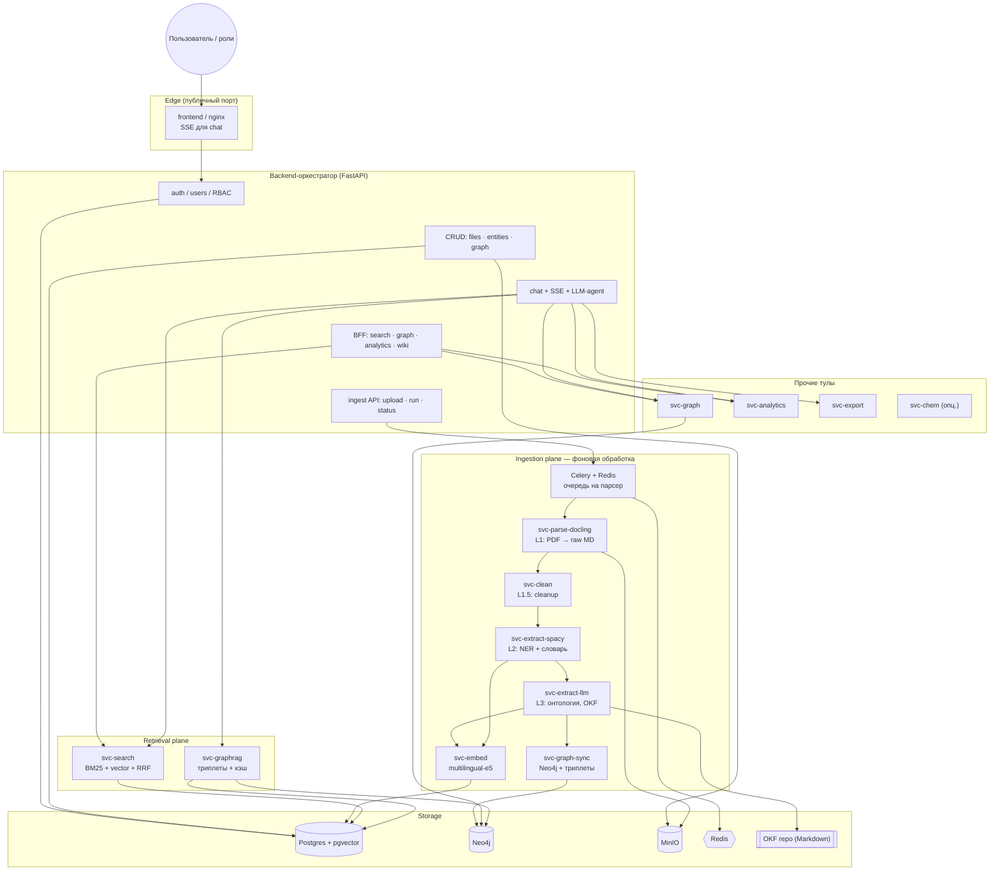

# Научный клубок — Техническая спецификация V5 (итоговая)

> **Проект:** Карта знаний R&D для горно-металлургической отрасли (Knowledge Graph + поисково-аналитическая система)
> **Команда:** 5 человек · **Формат:** хакатон, time-boxed
> **Версия:** 5.0 — итоговое решение после доп. созвона
> **Основано на:** текущий каркас репозитория, [SPEC_V4.md](SPEC_V4.md) (тулы как микросервисы), [SPEC_V3.md](SPEC_V3.md) (провенанс, гибридный поиск, claims/validator), `docs/TASK_EXPLANATION.md` (домен и требования)

---

## §0. Что меняется относительно V4 (решения созвона)

| # | Было в V4 | Стало в V5 | Причина |
|---|-----------|------------|---------|
| 1 | Ценность = «крутые фичи» (hypothesis factory, gap-предложения новых экспериментов) | **Ценность = полное покрытие всего корпуса** качественной онтологией. Проверяемо: «мы обработали все файлы, онтология по всем данным». | Не делаем «два проекта в одном». Побеждает решение, покрывающее весь массив, а не то, где «онтология субъективно лучше». |
| 2 | Экспериментоцентричный пайплайн (узко под сплавы) | **Обобщённая онтология для любой области** + горно-металлургия как инстанс. Доп. признаки (RU/EN, гео) — как **метки/метаданные узлов**, а не новые сущности. | Требование задачи: масштабируемость на новые домены. |
| 3 | Ingest — одна Celery-цепочка (9 стадий, no-op стабы) | **Многоуровневая фоновая обработка**: каждый парсер = **отдельный микросервис со своей очередью**; документ проходит несколько уровней качества параллельно/последовательно; статус виден по каждому файлу и уровню. | Главный вызов — **объём данных** и его стоимость. Нужна «круговая» система с постоянной подгрузкой. |
| 4 | CRUD не выделен явно | **CRUD + управление файлами — обязательны** (upload, list, reprocess, delete; ручная правка сущностей/графа экспертом). | Прямое требование: экраны загрузки данных, трекинг покрытия, ручная корректировка графа. |
| 5 | Поиск = hybrid (BM25+vector+custom+RRF), custom distance — сильный дифференциатор | **GraphRAG / мультиагентный RAG** как основной ответный контур (триплеты + кэш + переиндексация); hybrid остаётся базой. Custom distance — **опциональный** (домен сместился с сплавов). | Отвечает на все функциональные требования; кэш триплетов даёт скорость и повторное использование. |
| 6 | — | **Очередь = Celery + Redis** (зафиксировано; уже в репозитории, не тащим RabbitMQ). | Работает, минимум нового. |

Всё остальное из V4/V3 (тулы как микросервисы, провенанс по умолчанию, JWT/RBAC, degraded mode, merge-дисциплина, pgvector, Python 3.11) — **остаётся в силе**.

---

## §1. Постановка проблемы и главный вызов

### Боль (из `TASK_EXPLANATION.md`)
Знания R&D разрознены (PDF/DOC/таблицы/каталоги), не связаны, нет единой верифицированной карты: что уже пробовали, какие выводы подтверждены, где противоречия, кто носитель экспертизы. Итог — потеря памяти, дублирование обзоров, медленные решения, конфликтующие интерпретации.

### Главный вызов = ОБЪЁМ ДАННЫХ
Корпус — сотни–тысячи документов на двух языках. Полная качественная LLM-обработка всего массива дорогая и небыстрая. Поэтому:

- **Стратегия покрытия важнее «самой умной» онтологии.** Выигрывает полное, проверяемое покрытие корпуса.
- **Многоуровневая обработка**: быстрый дешёвый уровень даёт результат сразу; тяжёлый качественный уровень догоняет позже (вплоть до последнего дня — «деньги/мощности всегда успеем потратить»).
- **Система круговая**: непрерывная подгрузка новых файлов → фоновая обработка → обновление индексов и графа.

### Контрольные запросы (система обязана отвечать)
1. Обессоливание воды: сульфаты/хлориды/Ca/Mg/Na 200–300 мг/л, сухой остаток ≤1000 мг/дм³ → метод. *(процесс + числовые диапазоны)*
2. Циркуляция католита при электроэкстракции никеля + оптимальная скорость потока. *(процесс + числовой параметр + мировая практика)*
3. Распределение Au/Ag/МПГ между штейном и шлаком за 5 лет (эксперименты + публикации). *(материалы + временной диапазон + типы источников)*
4. Закачка шахтных вод в глубокие горизонты, РФ vs мир, ТЭП. *(процесс + география + экономика)*

### Пользователи / роли (из задачи)
researcher (R&D-инженер) · analyst (аналитик) · project_manager (руководитель) · admin (администратор) · external (внешний партнёр). Управление доступом к чувствительным данным (внутренние отчёты, коммерческая тайна), аудит действий.

---

## §2. Цели и KPI

### Цели
1. Развёрнутый онлайн-прототип: приём документов (RU/EN) + ответы в свободной форме с provenance.
2. Обобщённая онтология, связывающая сущности в единую карту знаний.
3. **Максимальное покрытие корпуса** с прозрачным трекингом (какие файлы, на каком уровне обработаны).
4. Фоновая обработка новых файлов без блокировки пользователя.
5. Многопараметрические запросы (материал + процесс + условия + гео + время + числовые ограничения) + подсветка противоречий.

### KPI

| Метрика | Цель | Измерение |
|---------|------|-----------|
| **Покрытие корпуса** | % файлов, доведённых до уровня L1/L2/L3 | Admin dashboard, `GET /api/v1/admin/coverage` |
| **Provenance coverage** | 100% утверждений со ссылкой | Автопроверка proof-ref в каждом claim |
| **Время ответа** | ≤ 3–5 c (легко достижимо) / ≤ 15 c полный LLM-ответ | Замер end-to-end, `/metrics` |
| **Точность извлечения / числовых ограничений** | > 80% F1 на hold-out | `eval/run_eval.py` |
| **Полнота графа** | > 70% сущностей связаны | связанные / изолированные ноды |
| **Live-добавление** | новый файл → виден в поиске за минуты (L1) | демо |
| **Детекция противоречий** | ≥ N конфликтов на демо-корпусе | `contradicts` в UI |

> Требование скорости 3–5 c при 1 млн сущностей — не узкое место (векторный поиск быстрый). Фокус усилий — покрытие и качество извлечения, не latency.

---

## §3. Архитектура

### Плоскости
- **Edge/Orchestrator** — nginx фронтенда (единственный публичный порт) + backend-оркестратор (FastAPI): auth, chat+SSE, RBAC, CRUD, provenance, приём файлов, LLM-агент.
- **Tool plane** — тулы агента как микросервисы (internal-only, свой `/docs`, `/health`, `/manifest`, `/invoke`).
- **Ingestion plane (★)** — сервис приёма + **набор парсер-микросервисов, каждый со своей Celery-очередью**; многоуровневая фоновая обработка.
- **Retrieval plane** — GraphRAG/мультиагентный RAG-сервис (триплеты + кэш + векторный индекс) + hybrid search.
- **Storage** — Postgres+pgvector, Neo4j (граф), MinIO (файлы), Redis (broker+cache+rate-limit), OKF-репозиторий (версионируемая база знаний в Markdown).

### Схема



### Ключевые решения

| # | Решение |
|---|---------|
| 1 | **Каждый парсер/экстрактор — отдельный микросервис со своей Celery-очередью.** Изоляция зависимостей (Docling, spaCy+ru, NuExtract, torch, RDKit не резолвятся вместе) + независимое масштабирование тяжёлых стадий. |
| 2 | **Многоуровневая обработка (L1→L2→L3).** Быстрый дешёвый уровень доступен сразу; тяжёлый догоняет. По каждому файлу видно, до какого уровня доведён. |
| 3 | **Всё в фоне.** `upload` → `202 Accepted` + task_id; обработка асинхронно; пользователь не ждёт. |
| 4 | **Celery + Redis** — единый брокер, много очередей (`parse.docling`, `clean`, `extract.spacy`, `extract.llm`, `embed`, `graph.sync`). |
| 5 | **CRUD-first.** Файлы и сущности — полноценные CRUD; эксперт может править граф вручную (с автором и датой). |
| 6 | **GraphRAG с кэшем триплетов.** Агент извлекает триплеты (subject-predicate-object) под запрос, кэширует, переиспользует при переиндексации. |
| 7 | **OKF (Open Knowledge Format)** — версионируемая база знаний в Markdown, растущая по глубине проработки (raw → разделённые → по-фактно на статью). |
| 8 | **Обобщённая онтология.** Базовые сущности/отношения домен-агностичны; RU/EN, гео, достоверность — метки/метаданные узлов. |
| 9 | **Provenance по умолчанию** + модель верификации (source, confidence, verified_at). |
| 10 | **Read/write split:** retrieval/tool плоскость read-only; запись — только через ingestion/CRUD. |
| 11 | **Единый контракт тула** (`/health`,`/manifest`,`/invoke`, envelope) + Tool Gateway (timeout/retry/circuit-breaker) + **in-process fallback**, чтобы упавший тул не ронял демо. |

### Единый контракт тул/парсер-сервиса
```
GET /health   → {status, name, version}
GET /manifest → описание для агента (JSON Schema in/out, degraded-поведение, очередь)
POST /invoke  → синхронный вызов (для агента) ИЛИ Celery-task (для фоновой обработки)
GET /docs     → Swagger UI
```

---

## §4. Ingestion и фоновая обработка (★ очереди)

### Сервис приёма (ingest API в backend)
Ручки (как проектировалось на созвоне):
```
POST /api/v1/ingest/upload            # загрузка файла(ов) → 202 + task_id, кладёт в MinIO, ставит в очередь
POST /api/v1/ingest/run               # (пере)запуск обработки файла/набора на нужном уровне
GET  /api/v1/ingest/status/{task_id}  # статус задачи
GET  /api/v1/ingest/files             # список файлов + текущий уровень обработки (L0..L3)
GET  /api/v1/ingest/files/{id}        # история конкретного файла: судьба, стадии, ошибки, метод парсинга
GET  /api/v1/admin/coverage           # агрегат покрытия по корпусу (для дашборда начальника)
GET  /health                          # health
```

### Многоуровневая обработка (по каждому файлу трекается независимо)

| Уровень | Что делает | Сервис / очередь | Скорость | Когда доступно |
|--------|------------|------------------|----------|----------------|
| **L0 · Upload** | файл в MinIO, запись `documents`, статус `queued` | ingest API | мгновенно | сразу |
| **L1 · Fast parse** | PDF/DOC/XLSX → сырой Markdown (Docling) + быстрый векторный индекс → уже ищется | `svc-parse-docling` / `parse.docling` | минуты | быстро (baseline) |
| **L1.5 · Cleanup** | пост-обработка Docling (правка артефактов таблиц/переносов) | `svc-clean` / `clean` | минуты | скоро |
| **L2 · spaCy NER** | сущности/отношения + нормализация RU/EN по словарю; числовые ограничения | `svc-extract-spacy` / `extract.spacy` | десятки минут | среднесрочно |
| **L3 · Deep LLM** | глубокая онтология: факты по-статейно, триплеты, OKF; NuExtract/сильные LLM | `svc-extract-llm` / `extract.llm` | часы, дорого | догоняет позже (вплоть до последнего дня) |
| **EMBED** | эмбеддинги (e5) → pgvector | `svc-embed` / `embed` | — | после L1/L2 |
| **GRAPH-SYNC** | Neo4j (full wipe + batch) + рёбра `contradicts` | `svc-graph-sync` / `graph.sync` | — | после L2/L3 |

Каждый уровень пишет прогресс в `experiments.ingest_tasks` и `documents.processing_level`. **Дашборд начальника** показывает по каждому файлу три индикатора (L1/L2/L3) — наглядно демонстрирует «глубину индексации».

### Топология очередей (Celery + Redis)
- Один брокер Redis, **отдельная очередь на каждый парсер-сервис** → тяжёлые стадии не блокируют лёгкие; каждый воркер масштабируется отдельно.
- Оркестрация: Celery `chain`/`chord` (L1→L1.5→L2→EMBED→GRAPH-SYNC) + независимый асинхронный запуск L3 (может стартовать позже, по мере доступа к ключам/мощностям).
- Ключи некоторых LLM синхронные → L3-воркеры делают контролируемо-последовательные вызовы с ограничением concurrency.
- Идемпотентность: повторная обработка файла не дублирует сущности (dedup через `entity_same_as` + `grouping_key`).

### OKF (Open Knowledge Format)
- Версионируемая база знаний в Markdown, генерируется на L3, растёт по глубине: `raw/` → `structured/` → `facts/<article_id>.md`.
- Хранится в репозитории/на диске + метаданные в Postgres; служит источником для GraphRAG и wiki.

### Парсинг — инструменты
- **Docling** — PDF/DOC → сырой Markdown (L1); + правила пост-очистки (L1.5).
- **spaCy** (`ru_core_news_lg`) + словарь синонимов (L2).
- **NuExtract / сильные LLM** — глубокое извлечение (L3), self-hostable.
- (опц.) парсинг картинок/таблиц с ссылками на изображения — nice-to-have.

---

## §5. CRUD и управление данными (★)

Полноценные CRUD поверх FastAPI-паттерна репозитория (`app/crud.py`), с RBAC.

### Файлы / документы
```
POST   /api/v1/documents            # = ingest/upload (создать + поставить в очередь)
GET    /api/v1/documents            # список (фильтры: статус, уровень, дата, тип)
GET    /api/v1/documents/{id}       # метаданные + история обработки
POST   /api/v1/documents/{id}/reprocess?level=L2|L3   # перезапуск обработки
DELETE /api/v1/documents/{id}       # удалить (файл + производные сущности) — admin
GET    /api/v1/sources/{id}/download # presigned MinIO URL (provenance), TTL 15m
```

### Сущности онтологии (materials, processes, experiments, publications, experts, facilities, properties, regimes, conclusions, tags)
```
POST   /api/v1/{entity}             # создать (analyst+)
GET    /api/v1/{entity}             # список + фильтры
GET    /api/v1/{entity}/{id}        # детально
PATCH  /api/v1/{entity}/{id}        # редактировать
DELETE /api/v1/{entity}/{id}        # удалить (admin)
```

### Ручная правка графа экспертом (требование задачи)
```
POST   /api/v1/graph/edges          # добавить/уточнить связь {from, rel, to, note}
PATCH  /api/v1/graph/edges/{id}     # правка
DELETE /api/v1/graph/edges/{id}
```
Каждая ручная правка фиксирует `edited_by` + `edited_at` + `note` (аудит).

### Аудит и версионирование
- Лог действий (запросы, просмотры, экспорт, правки) — таблица `audit_log`.
- Версионирование фактов: изменение вывода при новом источнике сохраняет предыдущую версию (`fact_versions`).

---

## §6. Доменная модель / обобщённая онтология

### Принцип
Онтология **домен-агностична**: базовые типы сущностей и отношений работают для любой области; специфика (RU/EN, гео, достоверность) — **метки/метаданные узлов**, а не новые типы. Горно-металлургия — первый инстанс.

### Сущности
`Material` · `Process` · `Experiment` · `Regime/Condition` · `Property` · `Equipment/Facility` · `Publication` · `Expert` · `Conclusion/Recommendation` · `Document/Source` · `Tag/Topic`.

Метаданные-метки на узлах: `lang` (ru/en), `origin` (domestic/foreign), `region`, `confidence`, `verified_at`, `sensitivity` (public/internal/commercial — для RBAC).

### Отношения (типизированные)
```
Experiment -uses_material-> Material          Process -produces_output-> Material|Property
Experiment -operates_at_condition-> Regime    Experiment -measures-> Property
Experiment -has_result-> Result               Experiment -performed_at-> Facility
Experiment -by-> Expert                        Conclusion -described_in-> Publication|Document
Conclusion -validated_by-> Experiment|Publication
Conclusion -contradicts-> Conclusion          Expert -expert_in-> Topic|Process
*любой факт -sourced_from-> Document           (provenance)
```

### Модель верификации (требование задачи)
Каждый `Result`/`Conclusion`: `proof_ref` (doc+page+paragraph), `confidence` {high/medium/low}, `source_count`, `verified_at`, `verified_by`, `origin`/`region`.

### Числовые ограничения (`experiments.constraints`)
`{entity, param, op(<=,>=,=,range), value_min, value_max, unit, canonical_si}` — отвечает на «сульфаты ≤300 мг/л», «сухой остаток ≤1000 мг/дм³», «производительность от 100 т/сут». Приведение единиц — `dictionaries/units.yaml`.

### Postgres-схемы
- `public`: `user`, `chat_session`, `chat_message`, `audit_log`.
- `experiments`: `materials`, `processes`, `experiments`, `results`, `regimes`, `properties`, `equipment`, `facilities`, `experts`, `publications`, `conclusions`, `constraints`, `documents`, `entity_aliases`, `entity_same_as`, `graph_edges`, `fact_versions`, `ingest_tasks`, `experiments_flat` (MV).

Базовые таблицы + pgvector + MV уже в миграциях; добавляем `processes/publications/conclusions/constraints/facilities/experts/graph_edges/fact_versions/audit_log` + поля меток.

### Neo4j — проекция графа (визуализация + path + contradicts)
Full wipe + batch при reindex (`svc-graph-sync`). Neo4j down → 503 для path, SQL fallback для subgraph.

### Словари
`synonyms_ru_en.yaml` (электроэкстракция↔electrowinning, ПВП↔flash smelting furnace, католит↔catholyte), `units.yaml`, `regime_buckets.yaml`, (опц.) `distance_weights.yaml`.
Словарь для spaCy строится отдельным треком (сильная LLM выделяет ключевые термины по корпусу; ruBERT — только для эмбеддингов слов, не для очистки).

---

## §7. Каталог микросервисов

### Ingestion / обработка (P0)
| Сервис | Очередь | Назначение | Deps |
|--------|---------|-----------|------|
| `svc-parse-docling` | `parse.docling` | PDF/DOC/XLSX → сырой Markdown (L1) | docling |
| `svc-clean` | `clean` | пост-очистка Markdown (L1.5) | — |
| `svc-extract-spacy` | `extract.spacy` | NER + RU/EN словарь + числ. ограничения (L2) | spaCy ru |
| `svc-extract-llm` | `extract.llm` | глубокая онтология, OKF, триплеты (L3) | NuExtract / LLM |
| `svc-embed` | `embed` | e5-large → pgvector | torch, sentence-transformers |
| `svc-graph-sync` | `graph.sync` | Neo4j batch + `contradicts` | neo4j-driver |

### Retrieval / ответы (P0/P1)
| Сервис | Назначение | Deps |
|--------|-----------|------|
| `svc-search` (P0) | hybrid: SQL pre-filter → BM25 (PG FTS) + vector → RRF | psycopg, pgvector |
| `svc-graphrag` (P1) | мультиагентный RAG: извлечение триплетов под запрос, кэш, переиндексация; векторный индекс | LLM, vector store (pgvector/Chroma) |
| `svc-graph` (P1) | Neo4j по шаблонам + subgraph + path | neo4j-driver |

### Аналитика / вспомогательные (P1)
| Сервис | Назначение |
|--------|-----------|
| `svc-analytics` | coverage, KPI, **contradictions**, **compare РФ vs мир**, **gaps**, **risk-zones**, **compare/technologies** (§16.1) |
| `svc-export` | отчёты Markdown / PDF / JSON-LD (FAIR) |
| `svc-chem` (опц.) | RDKit: SMILES/composition distance (если вернём custom-метрику) |

### Реестр тулов агента
`hybrid_search` (svc-search) · `graphrag_answer` (svc-graphrag) · `graph_template`/`get_subgraph`/`find_experts_by_topic` (svc-graph) · `find_contradictions`/`compare_practice`/`compare_technologies`/`find_gaps`/`sql_aggregate` (svc-analytics) · `export_report` (svc-export). Правила: ≥1 tool call на запрос; каждый claim → ≥1 источник; обзорный запрос → секции §16.1 P0.1; тул недоступен → degraded (таблица + provenance).

---

## §8. Поиск и ответы

### Базовый hybrid (svc-search)
`SQL pre-filter (материал/процесс/числовые диапазоны/гео/дата/тег) → BM25 (PG FTS RU) + vector (pgvector) → RRF`. LLM-rerank — opt-in (P2).

### GraphRAG / мультиагентный RAG (svc-graphrag)
1. Хорошо проиндексированный корпус (векторный + OKF-факты).
2. Под конкретный запрос агент быстро извлекает нужные сущности/**триплеты** (subject-predicate-object) обычным поиском по базе.
3. Триплеты — функции графа: сохраняются и **кэшируются**; при повторном/похожем запросе переиспользуются и переиндексируются → рост скорости и качества со временем.
4. Ответ = structured claims + provenance; противоречия/сравнения — через `svc-analytics`.

### Провенанс и верификация
Каждое утверждение → источник (doc+page+paragraph) + confidence + verified_at. Timeline и цепочки вывод→эксперимент→источник.

---

## §9. API (сводно)

```
# Auth/Users (template)
POST /login/access-token · POST /users/signup · GET /users/me

# CRUD документов/файлов  (§5)
POST/GET /documents · GET/DELETE /documents/{id} · POST /documents/{id}/reprocess
GET  /sources/{id}/download

# Ingest / фоновая обработка (§4)
POST /ingest/upload · POST /ingest/run · GET /ingest/status/{task_id}
GET  /ingest/files · GET /ingest/files/{id} · GET /admin/coverage

# CRUD сущностей + ручная правка графа (§5)
POST/GET/PATCH/DELETE /{entity}
POST/PATCH/DELETE /graph/edges

# Поиск / чат / граф / аналитика
POST /search
POST /chat/sessions · GET /chat/sessions · GET /chat/sessions/{id}
POST /chat/sessions/{id}/messages          # SSE
POST /graph/query · GET /graph/subgraph/{id} · GET /graph/path
GET  /analytics/coverage · /analytics/contradictions · /analytics/compare · /analytics/gaps · /analytics/risk-zones · /analytics/compare/technologies
POST /graph/experts-by-topic
GET  /metrics

# Wiki / экспорт
GET  /wiki/{entity_type}/{id} · GET /wiki/search
POST /export                                # md | pdf | jsonld
```
Все под `/api/v1`, JWT кроме auth. Внутренние тул-сервисы — только internal-сеть, `/health`,`/manifest`,`/invoke`.

**Валидация загрузки:** MIME whitelist (pdf/docx/xlsx/csv), max 50 MB, rate limit 10/мин (Redis), JWT + `is_superuser`/`admin`.

---

## §10. UI/UX (экраны по ролям)

| Экран | Роли | P |
|-------|------|---|
| `/login`, `/signup` | все | P0 |
| `/chat` + история сессий | researcher, analyst | P0 |
| `/search` (многопараметрическая форма + результаты с provenance) | все | P0 |
| `/ingest` (drag-and-drop, очередь, прогресс по файлам) | admin | P0 |
| `/admin/coverage` — **дашборд покрытия + зоны риска** (§16.1 P0.6): индикаторы L1/L2/L3, % покрытия, risk zones | project_manager, admin | P0 |
| `/documents` — CRUD файлов (список, reprocess, delete) | admin | P0 |
| `/wiki` (текст/таблица/граф) | все | P1 |
| `/graph` (эксплорер, подсветка `contradicts` + пробелы, path; **must-demo** §16.1 P0.5) | analyst | P0 |
| `/analytics/contradictions`, `/analytics/compare`, `/analytics/gaps` (РФ vs мир, таблицы ТЭП §16.1 P0.4) | analyst, PM | P0 |
| `/entities/*` — ручная правка сущностей/графа | analyst (expert) | P1 |
| настройки доступа / аудит | admin | P2 |

Дизайн: сначала **wireframe** (экономит токены при генерации), затем hi-fi. Фронт уже содержит скелеты chat/wiki/graph/analytics/ingest + generated OpenAPI-клиент + shadcn/ui + dark mode. Граф-виз — react-force-graph/D3.

**Принципы:** провенанс везде (клик → источник); confidence/geo/verified_at на карточках; наглядный прогресс обработки; десктоп primary.

---

## §11. Роли доступа (RBAC)

| Роль | Доступ |
|------|--------|
| `external` | Chat/Search/Wiki только по `sensitivity=public` |
| `researcher` | + внутренние (не commercial), без ingest |
| `analyst` | + CRUD сущностей, ручная правка графа, аналитика, экспорт |
| `project_manager` | + дашборды покрытия/риска |
| `admin`/superuser | всё + ingest/reprocess/delete, управление доступом, аудит |

Механизм — `Depends` на уровне API + фильтр `sensitivity` в BFF. Аудит — `audit_log`.

---

## §12. Технологический стек

| Слой | Технология |
|------|-----------|
| Base | full-stack-fastapi-template (shadcn/ui) — уже база |
| Backend/оркестратор | FastAPI, Python 3.11 |
| Тулы/парсеры | FastAPI-микросервисы (`packages/tool_sdk`), каждый — свой uv-проект/`uv.lock` |
| Очереди | **Celery + Redis** (много очередей, по одной на парсер) |
| ORM/миграции | SQLModel + Alembic |
| Auth/RBAC | JWT (pyjwt), pwdlib, роли на уровне API |
| Frontend | React 19, TanStack Router+Query, Tailwind v4, shadcn/ui, Biome; react-force-graph |
| БД | `pgvector/pgvector:pg18` |
| Файлы | MinIO (S3), presigned URL |
| Граф | Neo4j Community (P1) |
| Vector store | pgvector (основной); Chroma — внутри `svc-graphrag` (опц.) |
| Парсинг | Docling (L1) + cleanup; NuExtract/LLM (L3) |
| NER | spaCy `ru_core_news_lg` + словарь RU/EN |
| Эмбеддинги | `intfloat/multilingual-e5-large` |
| LLM | сильные LLM (онтология/ответы) + fallback provider; degraded без LLM |
| Экспорт | Jinja2 + WeasyPrint (PDF) + JSON-LD |
| Контейнеризация | Docker Compose (base + override dev + prod) |
| CI | GitHub Actions: test-backend, playwright, pre-commit (+ matrix для сервисов) |

---

## §13. Роли команды

Единица владения — свой набор сервисов/модулей + свои тесты.

| Зона | Ответственность | Артефакты |
|------|-----------------|-----------|
| **Инфра/Lead** | Compose, CI, `tool_sdk`, Tool Gateway, очереди, деплой | `compose*.yml`, `packages/`, `services/*/Dockerfile`, workflows |
| **Ingestion/Queues** | сервис приёма + парсер-микросервисы + очереди + статистика по файлам | `services/parse-*`, `services/clean`, `services/extract-*`, ingest API |
| **Data/RAG** | OKF-данные (растущее качество), `svc-graphrag`, векторный индекс, wiki, онтология | `services/graphrag`, `services/embed`, OKF repo, `dictionaries/` |
| **NLP** | spaCy-словарь RU/EN, L2-извлечение, числовые ограничения, (опц.) картинки/таблицы | `services/extract-spacy`, словарь |
| **Frontend** | сайт: загрузка данных, просмотр (wiki), экраны ролей, дашборд покрытия | `frontend/src/routes/*`, `components/*` |

Дисциплина: изоляция по сервисам минимизирует конфликты; модели — файл на домен; `*.gen.ts` пересобираются; Alembic/`uv.lock` — один owner на merge window (12:00/16:00/20:00).

---

## §14. Этапы работы (план по времени)

> Реперные точки: файлы уже выданы; доступ к реестру моделей/мощностям — с начала первой фазы; открытие + QA-сессия — к концу первой фазы; сдача — к финальному дедлайну. У команды ~2 дня.

### Фаза 0 — Ночь → утренний синк · «дать сырьё и каркас»
- **Data/RAG:** прогнать Docling по корпусу → **сырые Markdown-тексты** как можно быстрее (не дожидаясь полной обработки); начать OKF `raw/`.
- **Инфра/Lead:** `packages/tool_sdk` (контракт `/health,/manifest,/invoke`); скелет очередей Celery+Redis; `compose` для первых сервисов.
- **Ingestion:** спецификация и скелет ingest API (`upload`/`run`/`status`/`stats`) + первая очередь `parse.docling`; минимальный пример «один файл → парс → результат».
- **Frontend:** **wireframes** экранов под роли (researcher/PM/admin/external) + upload + дашборд покрытия.
- **NLP:** бутстрап словаря для spaCy (ключевые термины по корпусу через LLM, RU/EN).
- **Выход фазы:** есть сырые тексты для работы + скелет очереди + черновик экранов.

### Фаза 1 — После ключей → до открытия · «рабочий сквозной поток»
- Ingestion: `upload` → очередь → **L1 (Docling) → L1.5 cleanup → EMBED** → файл ищется. Статус по файлу (L0/L1) + `admin/coverage`.
- Retrieval: `svc-search` (BM25+vector+RRF) + `/search` UI.
- Chat: базовый агент с `hybrid_search`, structured claims + provenance, SSE.
- CRUD: документы (list/get/reprocess/delete) + `/documents` UI.
- Frontend: экраны login/chat/search/ingest/coverage — живые, на реальном API.
- **Выход фазы:** можно загрузить файл и получить ответ с источником; виден прогресс покрытия (L1).

### Фаза 2 — Вечер первой фазы → вторая фаза · «глубина и граф»
- Ingestion: **L2 (spaCy NER + словарь RU/EN + числовые ограничения)** → `extract.spacy` очередь; `graph.sync` в Neo4j.
- Retrieval: `svc-graphrag` (триплеты + кэш) как основной ответный контур; онтология по данным.
- Аналитика: `svc-analytics` — coverage, **contradictions**, **compare РФ vs мир**, **gaps**, **risk-zones**, **compare/technologies** (§16.1 P0).
- GraphRAG: шаблон литобзора + блоки экспертов/пробелов в ответе (§16.1 P0.1–P0.3).
- Граф: `svc-graph` (templates + subgraph) + `/graph` UI must-demo (подсветка `contradicts` + пробелы).
- Wiki + ручная правка графа экспертом; экспорт (MD/PDF/JSON-LD) — P1.
- Дашборд начальника: индикаторы L1/L2 + **зоны риска** (§16.1 P0.6).
- **Выход фазы:** граф + литобзор-ответы + таблицы сравнения + gaps/risks; покрытие L2 по большинству файлов.

### Фаза 3 — Вторая фаза (деньги/мощности) · «полное покрытие»
- Ingestion: **L3 (NuExtract/сильные LLM)** — глубокое извлечение по всему корпусу, OKF `facts/`, максимальное покрытие. Запуск заранее (стадия долгая, ключи синхронные → контролируемая concurrency).
- Индикаторы L3 «догорают» по файлам на дашборде → визуально показывает полноту.
- Полировка ответов, реранк (опц.), уведомления/экспорт (опц.).
- **Выход фазы:** максимально полное покрытие корпуса на дашборде — ключевой аргумент для жюри.

### Фаза 4 — Перед сдачей (вечер финальной фазы) · «упаковка»
- Полный gate: pytest + Playwright + сборка всех сервисов.
- Демо на hold-out (3 контрольных вопроса из §1) + live-загрузка файла на сцене.
- `demo_script.md`, презентация (проблема → live demo → покрытие/KPI → 1 слайд архитектуры), деплой (prod compose), запасной локальный зеркальный инстанс.
- Сдача: ссылка на VCS + архив + видео-демо + презентация + развёрнутое решение.

### Контрольные вехи
| Веха | Когда | Критерий готово |
|------|-------|-----------------|
| Сырые тексты + скелет очереди | начало первой фазы | один файл проходит L1 |
| Сквозной поток (upload→ответ) | до открытия | ответ с provenance, виден прогресс |
| Граф + GraphRAG + аналитика (§16.1 P0) | конец первой / вторая фаза | литобзор, gaps, compare/technologies, graph must-demo |
| Полное покрытие L3 | вторая фаза | дашборд показывает высокий % |
| Упаковка и деплой | к финальному дедлайну | зелёный gate, развёрнуто, демо готово |

---

## §15. Риски и митигации

| Риск | Митигация |
|------|-----------|
| **Объём/стоимость полной LLM-обработки** | Многоуровневость: L1 быстро и дёшево сразу, L3 догоняет; self-hosting (~6ч/~$70 оценка на парсинг); запуск L3 заранее |
| **Синхронные LLM-ключи (throughput)** | Ограниченная concurrency в L3-воркерах, отдельная очередь, батчинг |
| **Не успеть полное покрытие** | Не обязаны обработать всё; максимум возможного + честный дашборд покрытия; structured-first |
| **Качество NER RU/EN, синонимы** | Словарь RU/EN (LLM-выделение терминов) + spaCy; ручная валидация hold-out; L3 уточняет |
| **Много движущихся частей (микросервисы+очереди)** | Единый `tool_sdk`, `/health` у всех, in-process fallback, smoke-тесты `/invoke` |
| **Dependency hell (docling/spaCy/torch/NuExtract)** | Каждый парсер — свой образ/`uv.lock` |
| **LLM галлюцинации / API down** | Structured claims + validator + провенанс; fallback provider; degraded mode |
| **Neo4j sync fail** | SQL subgraph fallback; 503 для path |
| **SSE буферизуется nginx** | `proxy_buffering off` + curl-smoke |
| **Мердж-конфликты** | Изоляция по сервисам, merge windows, модели по файлам |

---

## §16. Вне скоупа

- **Фабрика гипотез / предложение новых экспериментов** — убрано (сверх-скоуп, «не делаем два проекта в одном»).
- **Custom distance metric (композиция/свойства)** — опционально, низкий приоритет (домен сместился со сплавов).
- Tensor/BMF, **ML-предсказание пробелов** (фабрика гипотез, генерация новых экспериментов) — только слайд «architecture ready», без кода. **Rule-based gap-анализ** — в скоупе, см. §16.1.
- Инкрементальные миграции (только (пере)обработка), мультитенантность, OAuth/LDAP, мобильная версия, дообучение моделей, интеграции ERP/LIMS, внешние базы (Materials Project/COD), Prometheus/Grafana (только `/metrics` + логи).

---

## §16.1. Must-have для соответствия `TASK_EXPLANATION.md`

> SPEC V5 закрывает ingest, граф, поиск, RBAC и provenance. Ниже — пункты из таски, которые **покрыты частично или не покрыты**, но **обязательны для максимального соответствия** формулировкам жюри. Реализуются поверх существующей архитектуры (GraphRAG + `svc-analytics` + UI), без новых микросервисов.

### Контекст: что уже есть vs что дотянуть

| Область таски | Статус в V5 | Действие |
|---------------|-------------|----------|
| Импорт, NLP, онтология, provenance | ✅ Покрыто | — |
| 4 контрольных запроса | ✅ Механизмы есть | Усилить синтез ответа (§16.1 P0.1, P0.4) |
| Литобзор / структурированный синтез | ⚠️ Частично | P0.1 |
| Пробелы в знаниях | ⚠️ ML убран | P0.2 (rule-based) |
| Эксперты/лаборатории по теме | ⚠️ Сущности есть, UX нет | P0.3 |
| Сравнительные таблицы (ТЭП, параметры) | ⚠️ compare без таблицы | P0.4 |
| Граф: цепочки + противоречия + пробелы | ⚠️ P1 | **P0.5** (must-demo) |
| Дашборд PM: зоны риска | ⚠️ Только coverage | P0.6 |
| Рекомендации (кейсы, эксперты, темы) | ⚠️ Не формализовано | P1.1 |
| Патенты / нормативка как тип документа | ⚠️ Парсятся как PDF | P1.2 |
| Экспорт PDF/MD/JSON-LD | P1 | P1.3 |
| Уведомления, активность команд, OAuth | ❌ Вне скоупа | Не делать |

### P0 — до демо (обязательно)

#### P0.1 · Шаблон ответа «литературный обзор»
**Требование таски:** группировка по методу / году / географии; консенсус vs разногласия; confidence + число источников.

**Реализация:**
- GraphRAG / chat-агент: фиксированный JSON-schema ответа → рендер в UI.
- Секции: `by_method[]`, `by_geo[]`, `by_year[]`, `consensus[]`, `disagreements[]` (из `contradicts`), `claims[]` с `confidence` + `source_count`.
- Промпт агента: «если запрос обзорный — всегда заполняй все секции».
- **Сервисы:** `svc-graphrag`, chat UI. **Фаза:** 2.

#### P0.2 · Выявление пробелов (rule-based, без ML)
**Требование таски:** неизученные комбинации «материал–режим–условие»; технологии только в РФ или только за рубежом.

**Реализация:**
- `svc-analytics` → `GET /analytics/gaps`:
  - комбинации из таксономии/тегов без связанных `Experiment`/`Conclusion`;
  - процессы/методы с `origin` ∈ {только domestic, только foreign};
  - флаг `low_coverage` если источников < 3 по теме.
- В ответе chat: блок «Пробелы» — «по комбинации X+Y данных нет / мало (N источников)».
- **Не делать:** ML-предсказание, фабрика гипотез (§16).
- **Сервисы:** `svc-analytics`, SQL + Neo4j. **Фаза:** 2.

#### P0.3 · Эксперты и лаборатории по теме запроса
**Требование таски:** показ связанных экспертов и лабораторий.

**Реализация:**
- После search/GraphRAG: graph-запрос `Expert -expert_in-> Topic/Process <- связан с результатами`.
- UI: блок «Связанные эксперты и лаборатории» в ответе chat/search (карточки: имя, лаборатория, кол-во публикаций/экспериментов по теме).
- Tool агента: `find_experts_by_topic`.
- **Сервисы:** `svc-graph`, chat UI. **Фаза:** 2.

#### P0.4 · Сравнительные таблицы технологий
**Требование таски:** таблицы сравнения по эффективности, CAPEX, климату, экологии; контрольный запрос №4 (ТЭП закачки шахтных вод).

**Реализация:**
- `svc-analytics` → `GET /analytics/compare/technologies` (или tool `compare_technologies`):
  - вход: список process/method IDs или текст запроса;
  - выход: таблица `{method, param, value, unit, origin, source_ref}[]`.
- UI: табличный компонент в `/analytics/compare` и embed в chat-ответ.
- Расширить `compare_practice` (РФ vs мир) колонками числовых параметров из `constraints`/`properties`.
- **Сервисы:** `svc-analytics`, frontend table. **Фаза:** 2.

#### P0.5 · Граф: цепочки + противоречия + пробелы (must-demo)
**Требование таски:** визуализация цепочек; подсветка противоречий и пробелов.

**Реализация:**
- Поднять `/graph` с P1 до **must-demo**:
  - path/subgraph по сущностям из текущего запроса;
  - красные рёбра `contradicts`;
  - серые/пунктирные узлы для комбинаций без данных (из P0.2).
- Кнопка «Показать на графе» из chat/search.
- **Сервисы:** `svc-graph`, react-force-graph. **Фаза:** 2 (не откладывать на фазу 3).

#### P0.6 · Дашборд PM: зоны риска
**Требование таски:** метрики покрытия по направлениям + зоны риска (мало источников, противоречия).

**Реализация:**
- Расширить `/admin/coverage`:
  - по темам/тегам: % покрытия L1/L2/L3 + число источников;
  - **риск** = `sources < 3` OR `contradictions > 0` OR `gap_count > 0`;
  - топ-5 рисковых тем.
- `GET /analytics/risk-zones` для PM-дашборда.
- Активность команд — **не P0** (доп. пожелание, см. «не делать»).
- **Сервисы:** `svc-analytics`, `/admin/coverage` UI. **Фаза:** 2.

### P1 — если успеете (усиливает соответствие, мало кода)

| # | Что | Реализация | Сервис |
|---|-----|------------|--------|
| P1.1 | **Рекомендации** (похожие кейсы, смежные темы, эксперты) | Блок в chat: graph-neighbors + top related entities по запросу | GraphRAG + `svc-graph` |
| P1.2 | **Тип документа** `patent` / `regulatory` | Поле `document_type` при ingest + фильтр в search | ingest API, `documents` |
| P1.3 | **Экспорт** PDF / MD / JSON-LD | Довести `svc-export` до демо-ready | `svc-export` |
| P1.4 | **Консенсус явно в UI** | Подзаголовок «N источников согласны» в секции consensus | chat UI |

### Явно не делать (не критично для таски)

- Push-уведомления о новых публикациях (доп. пожелание).
- Метрики активности команд на дашборде.
- ML gap-prediction, фабрика гипотез, Tensor/BMF.
- OAuth/LDAP, ERP/LIMS, интеграция с датчиками.
- Полный OWL/RDF/SHACL-стек (достаточно Postgres + Neo4j + JSON-LD).

### Привязка к фазам (§14)

| P0/P1 | Фаза | Критерий готовности |
|-------|------|---------------------|
| P0.1–P0.4 | Фаза 2 | Контрольные запросы №2 и №4 — ответ с таблицей/литобзором |
| P0.5 | Фаза 2 | Демо: клик из chat → граф с contradicts |
| P0.6 | Фаза 2 | PM-дашборд показывает ≥3 risk zones на корпусе |
| P1.* | Фаза 3 / полировка | Экспорт + рекомендации в ответе |

### Обновления API (сводка дополнений)

```
GET  /analytics/gaps                    # P0.2 — пробелы, domestic-only/foreign-only
GET  /analytics/risk-zones              # P0.6 — зоны риска для PM
GET  /analytics/compare/technologies    # P0.4 — таблица параметров
POST /graph/experts-by-topic            # P0.3 — эксперты/лаборатории по теме
```

Tool registry (дополнение к §7): `find_gaps`, `find_experts_by_topic`, `compare_technologies` → `svc-analytics` / `svc-graph`.

---

## Приложение A. OKF (Open Knowledge Format)
Версионируемая Markdown-база знаний, растущая по глубине: `raw/<doc>.md` (сырой текст) → `structured/<doc>.md` (очищенный, размеченный) → `facts/<article_id>.md` (факты по-статейно + триплеты + provenance). Метаданные (уровень, источник, дата) — во фронтматтере + в Postgres. Источник для GraphRAG и wiki.

## Приложение B. Топология очередей (Celery + Redis)
Очереди: `parse.docling` · `clean` · `extract.spacy` · `extract.llm` · `embed` · `graph.sync`. Оркестрация: `chain(L1 → L1.5 → L2 → embed → graph.sync)`; `extract.llm` (L3) — независимая асинхронная стадия с ограничением concurrency. Прогресс → `experiments.ingest_tasks` + `documents.processing_level`. `upload` возвращает `202 + task_id`; статус — `GET /ingest/status/{task_id}` и `GET /ingest/files/{id}`.

## Приложение C. Как отвечаем на контрольные запросы
| Запрос | Контур | Механизм |
|--------|--------|----------|
| Обессоливание, сульфаты 200–300, сухой остаток ≤1000 | search + `constraints` | SQL pre-filter по процессу + числовым ограничениям → vector rerank → claims+provenance |
| Католит при электроэкстракции Ni + скорость | search + compare | фильтр процесс/материал + `flow_rate`; оптимум по источникам |
| Au/Ag/МПГ штейн/шлак за 5 лет | search(date_from) + graphrag | материалы + временной фильтр; граф связывает Experiment↔Publication↔Conclusion |
| Закачка шахтных вод, РФ vs мир, ТЭП | compare + contradictions | группировка по `origin`; таблица ТЭП; подсветка расхождений |

## Приложение D. Глоссарий (дополнения)
| Термин | Определение |
|--------|-------------|
| **Уровень обработки (L1/L2/L3)** | Глубина извлечения по файлу: быстрый парс / spaCy / глубокий LLM |
| **OKF** | Open Knowledge Format — версионируемая Markdown-база знаний |
| **Триплет** | subject-predicate-object; факт графа, кэшируется в GraphRAG |
| **GraphRAG** | Мультиагентный RAG с извлечением/кэшем триплетов и переиндексацией |
| **Покрытие корпуса** | Доля файлов, доведённых до уровня L1/L2/L3 |
| **contradicts** | Ребро/факт о конфликте двух выводов по одной теме |
| **origin/region** | Гео-метка источника (РФ vs мир) |
| **sensitivity** | Метка чувствительности (public/internal/commercial) для RBAC |
| **degraded mode** | Ответ без LLM: таблица + provenance |
